# goache

Fast golang based cache system. Generic, sharded, goroutine-safe. Optimized for low latency, zero-allocation hot paths, and low memory overhead.

## When goache is the right choice

goache is built for **concurrent, write-heavy caching where every write must land**. Every claim below is a measured number from the [benchmarks](#benchmarks) further down, against five other Go cache libraries at working sets from 1,000 to 1,000,000 entries.

**Reach for goache when:**

- **Many goroutines hit the cache at once, *and the process has at least two cores*.** This is the case goache is built around: at 100,000 entries a concurrent `Get` costs **4.58 ns/op vs go-cache's 36.61**, an 8x difference that comes from sharding instead of one global lock. go-cache stays pinned near 37 ns/op at *every* size — its bottleneck was never cache size, only lock contention. Among the sharded libraries goache is fastest at every size but the smallest, where otter leads (3.26 vs 5.67 ns/op at 1,000 entries). The core-count condition is not a formality: on a single core sharding buys nothing, and `New` is the wrong constructor there — use [`NewSingleCore`](#single-core-mode-newsinglecore), which beats go-cache by 20-25% in that regime.
- **The workload writes as much as it reads.** goache leads plain `Set` at *every* size measured (32.63 ns/op at 100,000 entries; next best go-cache 39.11, then freecache 86.50, otter 137.6, theine 200.4, ristretto 287.4) and leads `SetWithTTL` at every size from 5,000 entries up (go-cache edges it by 0.9 ns/op at 1,000).
- **A dropped write would be a bug.** Every `Set` is applied synchronously before it returns. ristretto — the fastest library here at very large bounded sizes — explicitly may discard writes under pressure; goache never does.
- **You need a hard memory ceiling.** `WithMaxSize(n)` is an exact upper bound, not an approximation: the budget is split so per-shard limits sum to exactly n, and `Len()` can never exceed it ([docs/adr/0020](docs/adr/0020-shard-count-does-not-scale-eviction.md)).
- **Bounded caches up to ~50,000 entries.** goache leads eviction cost through that range (47.52 / 61.31 / 69.12 ns/op at 1k / 5k / 50k). See the caveat below for larger bounds.
- **Bulk writes against a live cache.** Repeated `SetMany`/`DeleteMany` are completely allocation-free ([docs/adr/0022](docs/adr/0022-bulk-bucket-scratch-reuse.md)).
- **You want typed keys and values with no dependencies.** Full generics, no `interface{}` boxing, and goache's own module has zero external dependencies — the comparison libraries live in a [separate module](bench/) so they never reach your build.

**Reach for something else when:**

- **The cache is read almost exclusively from one goroutine.** `New`'s sharding pays for a shard hash and one pointer hop that only earn their keep once goroutines compete: go-cache's `Get` beats it at every size (17.40 vs 23.84 ns/op at 100,000), and the same trade shows up in delete-then-reinsert churn at every size and in `GetWithTTL` up to 100,000 entries (past that goache edges ahead, 93.24 vs 94.21 at 1,000,000). This is an argument against `New`, not against goache — [`NewSingleCore`](#single-core-mode-newsinglecore) drops the sharding and wins that comparison instead.
- **Hit ratio under heavily skewed access matters more than throughput.** goache uses CLOCK (second-chance), deliberately chosen to keep `Get` write-lock-free ([docs/adr/0016](docs/adr/0016-clock-eviction.md)). theine and otter use W-TinyLFU, which keeps a better hit ratio on Zipf-like workloads. goache makes no hit-ratio claim; if that is your bottleneck, measure them.
- **You need a bounded cache of ~100,000+ entries under constant eviction.** ristretto's admission scales better there (89.94 ns/op at 100,000 and 76.34 at 1,000,000, vs goache's 110.4 and 269.8) — if you accept that it may drop writes to get it. Note ristretto's numbers in this category moved substantially between two clean runs, so treat them as directional ([docs/adr/0017](docs/adr/0017-size-parametrized-benchmarks.md)).
- **You need loading/stampede protection, hit-miss statistics, persistence, or a disk tier today.** None are implemented — they are tracked in [docs/roadmap.md](docs/roadmap.md), and theine, otter or sturdyc cover them now.
- **You cache raw bytes at a scale where GC pressure dominates.** freecache stores everything off-heap in a byte ring buffer, which goache's typed on-heap design does not attempt.

[docs/competitor-analysis.md](docs/competitor-analysis.md) has the qualitative comparison behind these numbers.

## Install

```
go get github.com/Nerzal/goache
```

## Usage

```go
c := goache.New[string, int]()

c.Set("a", 1)
v, ok := c.Get("a") // 1, true

c.SetMany([]goache.Entry[string, int]{
    {Key: "b", Value: 2},
    {Key: "c", Value: 3},
})

// Know roughly how many items you're loading upfront? Pre-size to skip
// Go's incremental map growth entirely — see Benchmarks below.
c2 := goache.New[string, int](goache.WithCapacity(10000))

// Entries can optionally expire. Plain Set/Get never touch the clock —
// only entries actually given a TTL pay for one, see Benchmarks below.
c.SetWithTTL("session-token", "abc123", 5*time.Minute)

c.SetMany([]goache.Entry[string, int]{
    {Key: "d", Value: 4, TTL: time.Minute}, // expires in a minute
    {Key: "e", Value: 5},                   // no TTL: TTL zero value = never expires
})

// Expired entries are hidden by Get automatically, but not reclaimed until
// something overwrites the key or Purge is called — goache runs no
// background goroutines of its own. Call this periodically if you use TTLs
// and want expired keys' memory reclaimed promptly.
removed := c.Purge()

// Remove entries explicitly, single or bulk.
c.Delete("a")
c.DeleteMany([]string{"b", "c"})

// Drop everything at once; the cache is still usable afterwards.
c.Clear()

// Bound the cache to at most n entries instead of growing forever. Once a
// shard is full, Set evicts via CLOCK (a second-chance approximation of
// LRU) — see Benchmarks below and docs/adr/0016-clock-eviction.md for why
// CLOCK and what it costs.
c3 := goache.New[string, int](goache.WithMaxSize(100_000))
```

Running on a single core — a Kubernetes pod at `limits.cpu: 1000m` or below, where Go 1.25+ sets `GOMAXPROCS=1` — use `NewSingleCore` instead. Same API, same options, no sharding:

```go
c := goache.NewSingleCore[string, int]()          // same methods as above
c2 := goache.NewSingleCore[string, int](goache.WithMaxSize(100_000))

// Deciding at startup from the runtime's own view of the CPU budget needs
// one variable that can hold either type — that's what Cacher is for. Its
// dynamic dispatch costs ~2 ns per call, so prefer keeping the concrete
// type when you can.
var cache goache.Cacher[string, int]
if runtime.GOMAXPROCS(0) == 1 {
    cache = goache.NewSingleCore[string, int]()
} else {
    cache = goache.New[string, int]()
}
```

`WithShardCount` is meaningless to `NewSingleCore` and ignored, so one shared `[]goache.Option` can be passed to either constructor. See [Single-core mode](#single-core-mode-newsinglecore) for the numbers and the crossover point.

## Architecture

`Cache[K comparable, V any]` shards keys across N independently-locked segments (`sync.RWMutex` per shard, `hash/maphash.Comparable` for routing) instead of one global lock or `sync.Map`. See the package doc comment in `cache.go` for the full reasoning, including why Go's experimental `arena` package was evaluated and rejected for this phase, and a log of optimizations that were tried and measured — some kept (cache-line-padded contiguous shard storage, entry recycling on bounded shards), several reverted and documented so they aren't re-attempted blind (a custom open-addressed per-shard table replacing Go's map, and three more in [docs/adr/0018](docs/adr/0018-gemini-analysis-experiments.md)).

`SingleCoreCache[K comparable, V any]` (via `NewSingleCore`) is a second, independent implementation of the same operations for processes that run on one core: one map behind one `sync.RWMutex`, no shard routing, no per-entry eviction metadata unless `WithMaxSize` is set. It exists because a branch inside `Cache` was built, measured, and found insufficient — the sharded path is left completely untouched by it, so it cannot regress. See [docs/adr/0026](docs/adr/0026-single-core-cache.md), which also records why returning an interface from `New` was rejected on measurement.

Phase 1 scope: `Set`, `SetMany`, `Get`, `Delete`, `DeleteMany`, `Clear`, `WithCapacity` (pre-sizing). Phase 2: optional per-entry TTL via `SetWithTTL`/`Entry.TTL`, lazily enforced in `Get`, reclaimed via the caller-driven `Purge` — no background goroutine (see docs/adr/0011) — plus bounded automatic eviction via `WithMaxSize`, using a per-shard CLOCK (second-chance) policy chosen specifically so `Get` never needs a write lock to track recency (see docs/adr/0016). Remaining roadmap items (loading cache, stampede protection, stats) are tracked in [docs/roadmap.md](docs/roadmap.md).

## Benchmarks

Run: `make bench` (or `go test -bench=. -benchmem -run=^$ ./...`). Charts below are regenerated with `make charts` after updating the numbers in this file — see `docs/benchcharts/main.go`.

Last measured on AMD Ryzen AI 9 HX 370 (24 threads), Go 1.26.2:

```
BenchmarkSet-24               39031269    30.84 ns/op     0 B/op   0 allocs/op
BenchmarkSetMany-24           11063608   103.4 ns/op    340 B/op   2 allocs/op
BenchmarkGet-24               51125614    22.94 ns/op     0 B/op   0 allocs/op
BenchmarkGetMiss-24           20432000    56.81 ns/op     7 B/op   0 allocs/op
BenchmarkParallelGetSet-24   189708112     6.236 ns/op    0 B/op   0 allocs/op
BenchmarkParallelGet-24     265806045     4.601 ns/op    0 B/op   0 allocs/op
```

`Set`/`Get` are zero-allocation on the hot path — both cycle over the same fixed 100k-key pool, so after the first pass every call overwrites an already-allocated entry rather than inserting a new one. `SetMany`'s benchmark never repeats a key, so it shows the real cost of a cold insert: 2 allocs/op (the per-call shard-bucket grouping, same as before, plus one now-unavoidable heap allocation per new entry — see "Automatic eviction" below for why entries became individually heap-allocated). `GetMiss`'s alloc is the benchmark's own key-string construction, not the cache.

`ParallelGetSet`/`ParallelGet` dropped ~15-20% from pre-padding numbers (7.366→6.236, 5.474→4.601) after padding each shard to a full cache line in a contiguous `[]shard[K, V]` slice, removing false sharing between adjacent shards' mutexes — see [docs/adr/0018](docs/adr/0018-gemini-analysis-experiments.md), which supersedes [docs/adr/0004](docs/adr/0004-shard-storage-pointer-slice.md)'s earlier (unpadded) measurement. Single-threaded `Set`/`Get` are flat, as expected — false sharing is a multi-core effect.


### Ingestion: `WithCapacity` pre-sizing

Bulk-loading a fresh cache when the final size is roughly known upfront (`BenchmarkFreshLoad_*`, 10k entries via `SetMany` into a brand-new `Cache`):

```
BenchmarkFreshLoad_NoHint-24                1132   1047438 ns/op   2519739 B/op   14009 allocs/op
BenchmarkFreshLoad_WithCapacityHint-24      1274    816126 ns/op   2131853 B/op   12749 allocs/op
```


`WithCapacity` pre-sizes every shard's map so bulk inserts skip Go's incremental map growth/rehashing — but its relative payoff got noticeably noisier once `WithMaxSize` support made every new key's entry a separate heap allocation (see "Automatic eviction" below and [docs/adr/0016](docs/adr/0016-clock-eviction.md)): pre-sizing the map no longer addresses the now-dominant allocation cost, and the speed improvement has ranged from ~6% to ~17% faster across repeated runs (allocations/memory savings stay a consistent ~9%/~15% though), down from a steady ~24%/~30%/~24% before that change. Still worth using whenever you know the approximate final size upfront (e.g. loading a fixed data set at startup) — just don't expect it to compensate for allocation-heavy cold-insert workloads the way it used to, and expect run-to-run variance in exactly how much it helps.

### Optional TTL

`SetWithTTL`/`Entry.TTL` let individual entries expire. The clock is only read when the *found* entry actually has a TTL, so looking up a plain `Set`/`SetMany` entry (no TTL) costs exactly what `Get` costs above — the numbers below are `BenchmarkSetWithTTL`/`BenchmarkGetWithTTL` (against entries that *do* have a TTL) next to the plain `Set`/`Get` numbers for comparison, plus `BenchmarkPurge` (sweeping 100k already-expired entries across 256 shards):

```
BenchmarkSetWithTTL-24      28772359    41.96 ns/op     0 B/op   0 allocs/op
BenchmarkGetWithTTL-24      41216008    28.54 ns/op     0 B/op   0 allocs/op
BenchmarkPurge-24                210   5592490 ns/op     0 B/op   0 allocs/op
```

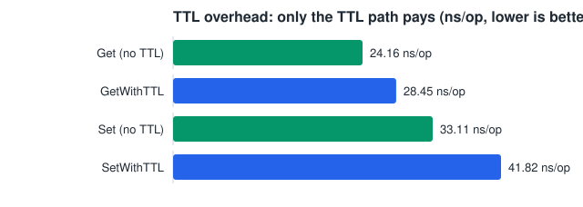

`entry` grew by 8 bytes (an `int64` expiry deadline, 0 = never expires) to support this. That extra 8 bytes shows up as a genuine per-call cost on `SetWithTTL` itself (~19ns — one `time.Now()` + `Add` + `UnixNano()`, unavoidable if you're actually setting a deadline) and on `GetWithTTL` (~8ns — one clock read, only for entries that actually have a TTL). Steady-state `Get`/`Set` against non-TTL entries is unaffected by TTL specifically (verified with `-cpu=1` to rule out scheduler noise — see docs/adr/0012). `Purge` is never called automatically; call it yourself (e.g. from your own ticker) if you use TTLs and want expired keys' memory reclaimed promptly — see the package doc comment in `cache.go` and docs/adr/0011 for why goache doesn't start a background goroutine for this itself.

`Purge`'s own number moved substantially since TTL was added (2.56ms baseline -> 5.7-7.1ms across repeated post-eviction runs) for a reason unrelated to TTL: it's a consequence of `WithMaxSize` support (see below), which changed shard storage to individually heap-allocated entries. `Purge`'s sweep here reports 0 allocs/op consistently (this benchmark doesn't configure `WithMaxSize`, so no eviction bookkeeping runs) — the slowdown is a cache-locality cost: entries are no longer packed inline in the map's own buckets, so a full-map sweep now chases one extra pointer per entry. The exact magnitude varies noticeably run-to-run (more than doubled, not a precise multiplier) — see [docs/adr/0016](docs/adr/0016-clock-eviction.md) for the full measurement and reasoning; it applies to any full-cache sweep, not just `Purge`.

### Deletion: `Delete` / `DeleteMany` / `Clear`

`Delete` and `DeleteMany` follow the same shape as `Set`/`SetMany` — `DeleteMany` groups keys by destination shard so each shard's lock is acquired once regardless of how many keys are being removed. `Clear` empties every shard using Go's builtin `clear()`, which is fast enough that isolating its cost from cache (re)population isn't meaningful the way `Purge`'s cost is — `BenchmarkClear` below measures populate-then-Clear together (same shape as `BenchmarkFreshLoad_NoHint`); Clear's own marginal cost is roughly the difference between the two numbers.

```
BenchmarkDelete-24             30266572    39.73 ns/op      0 B/op   0 allocs/op
BenchmarkDeleteMany-24         17002633    70.53 ns/op     84 B/op   1 allocs/op
BenchmarkDeleteSetChurn-24     13441732    85.54 ns/op      0 B/op   0 allocs/op
BenchmarkSetManyRepeated-24      504318    2418 ns/op       0 B/op   0 allocs/op
BenchmarkDeleteManyRepeated-24   598339    2014 ns/op       0 B/op   0 allocs/op
BenchmarkClear-24                100  10891976 ns/op   22986902 B/op   106407 allocs/op
```

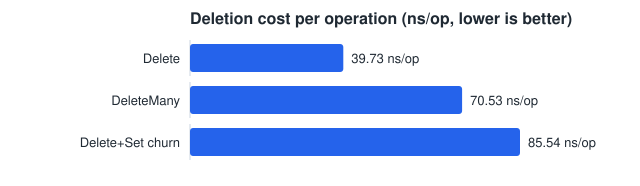

`Delete` is zero-allocation, same cost class as `Set`. `DeleteMany`'s single alloc/op is the same per-call shard-bucket grouping cost `SetMany` already pays. `Clear`'s number includes populating a fresh 100k-entry cache first (see `BenchmarkFreshLoad_NoHint` above, ~1.0ms) — the `Clear()` call itself only accounts for a fraction of the ~11.0ms total; the rest, including essentially all 106406 allocs/op, is the `SetMany` population that precedes it in the benchmark (see "Automatic eviction" below for why every new key now allocates).

`BenchmarkDeleteSetChurn` (delete a key, immediately re-insert it — the workload `bench/`'s cross-library Delete comparison measures) is fully allocation-free: on unbounded caches, `Delete` parks the removed entry in a one-slot per-shard freelist and the next brand-new-key `Set` on that shard reuses it, instead of paying the one-heap-allocation-per-new-key cost that eviction support introduced. That's ~31% faster churn (124.8 → 85.5 ns/op) for ~1-2ns added to `Delete` itself (the park is a single pointer store; see [docs/adr/0019](docs/adr/0019-single-slot-freelist.md)). Bounded (`WithMaxSize`) caches don't use the freelist — their delete/evict path already recycles entries through a `sync.Pool` (see [docs/adr/0018](docs/adr/0018-gemini-analysis-experiments.md)).

`BenchmarkSetManyRepeated`/`BenchmarkDeleteManyRepeated` measure repeated bulk calls against one long-lived cache — the shape a running service produces, as opposed to `BenchmarkSetMany`/`BenchmarkDeleteMany` above, which build a throwaway cache per call and so measure cold cost only. Both are **completely allocation-free** now: the shard-grouping scratch space (one outer slice plus one slice per non-empty bucket — **101 allocations per call** before this, hidden behind a benchmark that reported "2 allocs/op") is kept on the cache and reused via a single atomic swap, making repeated bulk calls 54-60% faster. One-shot bulk calls on a fresh cache pay a small fixed reset cost instead (3-6%), and 10k-entry bulk ingestion (`BenchmarkFreshLoad_*` above) is unaffected — see [docs/adr/0022](docs/adr/0022-bulk-bucket-scratch-reuse.md), which also records why a `sync.Pool` was tried first and abandoned.

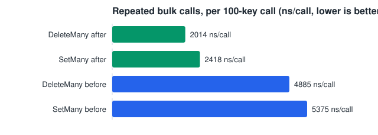

### Automatic eviction: `WithMaxSize`

`WithMaxSize(n)` bounds the cache to **at most** n entries and turns on per-shard CLOCK (second-chance) eviction once a shard is full. The budget is split so per-shard limits sum to exactly n, so `Len()` can never exceed it; if n is below the shard count, the shard count drops to the largest power of two ≤ n so every shard still gets a slot ([docs/adr/0020](docs/adr/0020-shard-count-does-not-scale-eviction.md) — this used to be a soft "roughly n" that could overshoot badly: `WithMaxSize(100)` on the default 256 shards held 256 entries). Because keys land by hash rather than perfectly evenly, a cache under churn typically settles somewhat *below* n — n bounds memory, it doesn't reserve it. CLOCK was chosen over two alternatives — see [docs/adr/0016-clock-eviction.md](docs/adr/0016-clock-eviction.md) for the full reasoning:

- True LRU (move-to-front on every `Get`) would need `Get` to take a write lock on every hit, undoing the entire point of sharding: letting concurrent readers never block each other.
- W-TinyLFU-style admission (what theine-go and otter/v2 use — see [docs/competitor-analysis.md](docs/competitor-analysis.md)) gives a better hit ratio under skewed workloads, but costs real CPU on every `Set`, which is exactly the cost goache currently beats those libraries on.

CLOCK keeps `Get` at effectively its current cost: each entry carries one atomic "referenced" bit, flipped by `Get` with a plain atomic store — no write lock, no ring mutation. Eviction (which does need the write lock) walks a per-shard circular ring from a "hand" pointer, clearing the bit on anything it finds set and evicting the first entry it finds already clear.

```
BenchmarkSetWithMaxSize-24   14540342    72.63 ns/op     0 B/op   0 allocs/op
BenchmarkGetWithMaxSize-24   41349081    26.19 ns/op     0 B/op   0 allocs/op
BenchmarkEvictionChurn-24    10518242   115.0 ns/op      8 B/op   1 allocs/op
BenchmarkEvictionChurnLarge-24 10158661  125.5 ns/op      8 B/op   1 allocs/op
BenchmarkEvictionChurnHot-24  10780498   125.3 ns/op      8 B/op   1 allocs/op
BenchmarkParallelGetWithMaxSize-24 248959453   4.853 ns/op   0 B/op   0 allocs/op
```

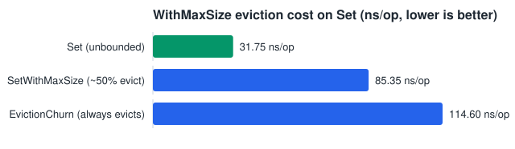

`GetWithMaxSize` is barely different from plain `Get` (26.19 vs 22.94 ns/op) — the only added cost is one atomic bit store; `ParallelGetWithMaxSize` confirms this holds under concurrency too (4.853 ns/op, in line with plain `ParallelGet`'s 4.601). `BenchmarkSetWithMaxSize` (cache capped at half the key pool, so roughly every other `Set` evicts) and `BenchmarkEvictionChurn` (cache always full, *every* `Set` evicts) show the cost of enabling eviction: 72.63 and 115.0 ns/op respectively, both down substantially (~44% and ~34%) from pre-pooling numbers (130.8 and 174.9 ns/op) after entries on `WithMaxSize`-bounded shards started recycling through a `sync.Pool` instead of always allocating fresh on every eviction-driven insert — allocs/op dropped from 1→0 and 2→1 accordingly. See [docs/adr/0018](docs/adr/0018-gemini-analysis-experiments.md) for the full measurement, including why this pooling is deliberately *not* applied to unbounded caches (it regressed `Delete`/`Clear`/`SetMany`/`FreshLoad_*` there in an earlier, cache-wide attempt, since nothing ever draws those entries back out of a pool that's never drained by eviction).

**Supporting eviction at all still requires a real, unconditional cost, not just an opt-in one**: to let `Get` flip the CLOCK bit without taking a write lock, shard storage changed from `map[K]entry[V]` (values inlined in the map) to `map[K]*entry[K, V]` (individually heap-allocated entries) — for *every* `Cache`, whether or not `WithMaxSize` is ever called. Ring maintenance, the eviction sweep, and pool interaction are all skipped entirely when no limit is configured, but the pointer-per-entry storage isn't. In practice this cost is small for steady-state workloads (see the core-ops numbers above — cycling over an existing key pool almost never allocates, since overwrites reuse the existing pointer) but real for cold-insert-heavy and full-sweep workloads on unbounded caches (`SetMany`, `FreshLoad_*`, `Purge`, `Clear` above all moved from the pre-eviction baseline). [docs/adr/0016](docs/adr/0016-clock-eviction.md) has the full before/after measurement and reasoning, including a locality regression on full-map sweeps that's separate from the allocation-count increase.

**The CLOCK sweep itself is not where bounded caches spend their time.** `BenchmarkEvictionChurnLarge` (a single shard holding 100,000 entries, so the hand *could* walk 100,000 slots) costs 125.5 ns/op — barely more than the 10,000-entry `BenchmarkEvictionChurn` at 115.0, and *less* than the 269.8 ns/op the cross-library comparison shows at n=1,000,000 spread over 256 shards of ~1,950 slots each. Instrumenting the hand confirms why: it walks **0.00-2.54 slots per eviction** across every workload measured, and 1.00 even under a continuous 9-reads-per-write mix — the entries near the hand are the oldest ones, whose reference bits were cleared on an earlier pass, while reads land on recently-inserted keys far from it. A contiguous bit-map rewrite of the sweep was designed and then rejected on that evidence, without being implemented ([docs/adr/0023](docs/adr/0023-reject-clock-bitmap.md)). What the `Bounded` numbers actually track is working set versus CPU cache: goache's *unbounded* `Set` already scales 4.56x from n=1,000 to n=1,000,000 (27.91 → 127.2 ns/op) with no eviction involved at all, against 5.68x for `Bounded` — so eviction contributes roughly 1.25x and memory hierarchy the rest.

## Performance under a CPU limit

Go services frequently run in containers that get a fraction of a core. A Kubernetes pod with `limits.cpu: 100m` is entitled to a tenth of one CPU, and since Go 1.25 the runtime derives `GOMAXPROCS` from the cgroup quota — so such a pod runs with **`GOMAXPROCS=1`**, not with the host's core count. Every other number in this README was measured on 24 cores, which is the opposite end of that range.

Run it yourself with `make bench-cpu` (goache alone) and `make bench-compare-cpu` (all libraries).

### goache across core counts

ns/op, 100,000-entry working set. `Get`/`Set` are single-goroutine and shown for reference; the `Parallel*` rows are the ones `GOMAXPROCS` actually affects.

| Benchmark | 1 core | 2 | 4 | 8 | 24 |
|---|---|---|---|---|---|
| `Get` (single-goroutine) | 25.02 | 24.93 | 25.27 | 24.16 | 24.24 |
| `Set` (single-goroutine) | 33.72 | 32.40 | 32.27 | 32.71 | 31.61 |
| `ParallelGet` | 23.36 | 14.02 | 7.506 | 7.758 | 4.614 |
| `ParallelGetSet` | 27.47 | 17.32 | 11.58 | 9.312 | 6.044 |
| `ParallelGetWithMaxSize` | 26.74 | 16.56 | 8.687 | 9.067 | 4.794 |
| `ParallelGetConstrained` (32 goroutines per core) | 23.29 | 14.58 | 7.609 | 7.762 | 4.638 |
| `ParallelGetSetConstrained` (32 goroutines per core) | 25.98 | 15.35 | 9.609 | 10.42 | 6.639 |

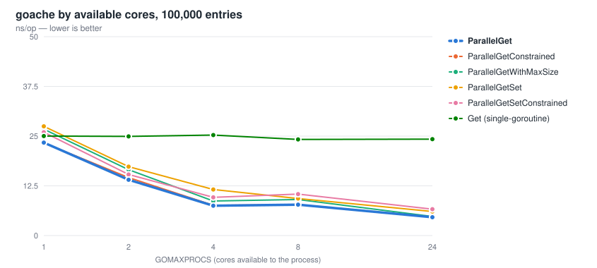

Two things worth reading off this table:

**At one core, concurrent `Get` costs the same as a plain single-goroutine `Get`** (23.36 vs 25.02 ns/op). That is the honest shape of the situation: with a single `P` only one goroutine runs at a time, so there is no lock contention for sharding to relieve — goache pays the shard hash and gets nothing back for it. Each core you add roughly halves the cost until about 4, and 24 cores land at 4.6 ns/op, 5x the one-core figure.

**Oversubscription is not a separate problem.** The `*Constrained` rows put 32 goroutines in flight per core — the shape of a request handler serving many connections on little CPU — and read performance is unchanged from the default (23.29 vs 23.36 at one core). Only mixed read/write at high core counts pays for it (`ParallelGetSetConstrained` 6.639 vs `ParallelGetSet` 6.044 at 24 cores, about 10%).

### Against other libraries, by core count

Concurrent `Get`, 100,000 entries, ns/op. Rows ordered by their one-core cost:

| Library | 1 core | 2 | 4 | 8 | 24 |
|---|---|---|---|---|---|
| go-cache | **16.88** | 25.50 | 17.56 | 27.29 | 37.41 |
| goache | 24.51 | **14.08** | **7.399** | 7.587 | 4.687 |
| otter | 34.38 | 24.86 | 9.695 | **5.899** | **3.924** |
| ristretto | 37.31 | 32.37 | 16.10 | 15.99 | 8.211 |
| freecache | 103.7 | 52.92 | 27.16 | 26.02 | 16.18 |
| theine | 133.5 | 81.79 | 75.17 | 12.57 | 6.443 |

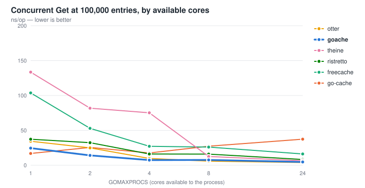

**`New`'s sharded cache is not the fastest choice on a single core — go-cache is: 16.88 vs 24.51 ns/op, so it costs 45% more there.** go-cache's one global mutex is uncontended when only one goroutine can run, so it pays nothing for locking and nothing for a shard hash. That advantage inverts immediately: at two cores goache costs 45% *less* than go-cache (14.08 vs 25.50), and by 24 cores it is 8x cheaper (4.687 vs 37.41), because go-cache's single lock gets *worse* with every core added (16.88 → 37.41 ns/op) while goache's cost keeps falling.

The crossover sits between one and two cores. In Kubernetes terms: a pod with `limits.cpu: 100m` or `500m` runs the leftmost column; from roughly `2000m` upward `New` is the fastest option in this table until otter overtakes it at eight cores. **For the leftmost column, use `NewSingleCore` instead — the next section.**

These numbers use `GOMAXPROCS` as the stand-in for a CPU limit, which models how many threads run in parallel — the thing the sharding argument turns on. It does **not** model CFS throttling, where a pod that exhausts its quota is frozen entirely until the next period. A probe running the single-goroutine `BenchmarkGet` inside `docker run --cpus=0.1` measured 485.3 ns/op against 25.02 at `GOMAXPROCS=1`: 19x slower with no concurrency involved, and about 1.9x worse than the 10% quota by itself explains. Read the one-core column as the optimistic end of sub-core behaviour; [docs/sub-core-benchmark-plan.md](docs/sub-core-benchmark-plan.md) scopes measuring it properly.

Also visible: **freecache and theine are the wrong choice on constrained CPU specifically** — at one core they cost 103.7 and 133.5 ns/op, four to six times goache, and theine only becomes competitive at eight cores. Their designs assume parallelism that a throttled container does not have.

### Single-core mode: `NewSingleCore`

`NewSingleCore` returns a second, unsharded implementation for exactly the regime above: one map behind one `sync.RWMutex`, no shard hash, no shard-slice indirection, and — unless `WithMaxSize` is set — entries that carry only a value and a deadline instead of the CLOCK bookkeeping `Cache` needs. It supports the same methods and the same options; `WithShardCount` is simply ignored.

Run these with `make bench-compare-singlecore` (against other libraries) and `make bench-singlecore` (against `Cache`). All numbers below are at **`-cpu=1`**, 100,000-entry working set, AMD Ryzen AI 9 HX 370, Go 1.26.2 — each table from a single back-to-back run.

#### Against go-cache, the library it has to beat

ns/op, `-count=3` range:

| Benchmark | `NewSingleCore` | go-cache | `New` (sharded) |
|---|---|---|---|
| `Get` | **17.13-17.29** | 22.04-24.26 | 27.80-30.19 |
| `Set` | **25.57-27.86** | 49.93-56.25 | 36.35-38.44 |
| `ParallelGet` | **16.77-17.28** | 21.04-21.92 | 26.83-29.62 |
| `ParallelGetSet` (90/10) | **18.00-18.46** | 23.35-23.65 | 28.81-33.64 |

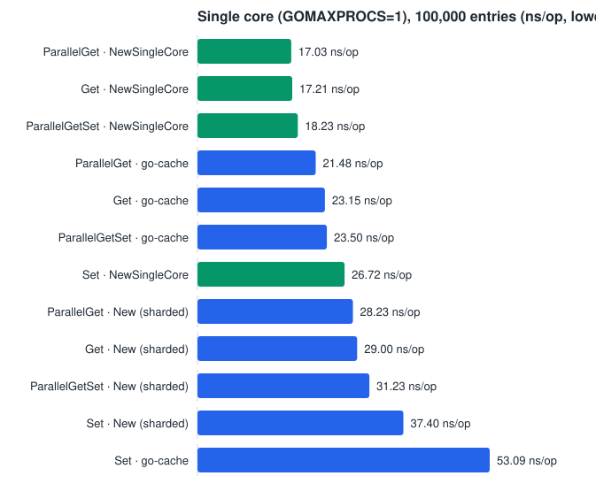

**`NewSingleCore` wins all four, by 20-25% on reads and 48% on `Set`** — go-cache boxes every value as `interface{}`, which also costs it one allocation per `Set` that goache never pays. Mixed read/write is the case that had no prior coverage in this suite at all (`BenchmarkGoCache_ParallelGetSet` was added for it), and it is where the single-lock design was most in question: one lock is not a liability when only one goroutine can run.

These absolute figures sit above the previous section's for the same benchmarks because the machine was in a different state; the comparison holds because all three were measured in one run.

#### Against `New`, benchmark by benchmark

| Benchmark | `New` | `NewSingleCore` | |
|---|---|---|---|
| `Get` | 25.20 | 16.39 | **-35%** |
| `GetMiss` | 60.62 | 51.69 | -15% |
| `Set` | 31.51 | 26.04 | -17% |
| `GetWithTTL` | 29.93 | 21.68 | -28% |
| `SetWithTTL` | 44.59 | 35.31 | -21% |
| `SetMany` | 100.1 (2 allocs) | 58.79 (1 alloc) | **-41%** |
| `SetManyRepeated` | 2513 | 919.8 | **-63%** |
| `DeleteManyRepeated` | 1880 | 203.8 | **-89%** |
| `DeleteSetChurn` | 91.16 | 78.35 | -14% |
| `Purge` | 7.21 ms | 3.86 ms | **-47%** |
| `Clear` | 12.90 ms / 23.0 MB | 9.28 ms / 8.6 MB | -28% / -63% |
| `GetWithMaxSize` | 27.56 | 20.55 | -25% |
| `SetWithMaxSize` | 85.60 | 58.43 | -32% |
| `EvictionChurn` | 131.5 | 103.3 | -21% |
| `EvictionChurnLarge` | 146.1 | 140.6 | -4% |
| `EvictionChurnHot` | 142.8 | 131.3 | -8% |
| `ParallelGet` | 24.46 | 16.25 | **-34%** |
| `ParallelGetSet` | 27.14 | 17.70 | **-35%** |
| `ParallelGetConstrained` | 24.42 | 16.20 | -34% |
| `ParallelGetSetConstrained` | 26.73 | 18.37 | -31% |

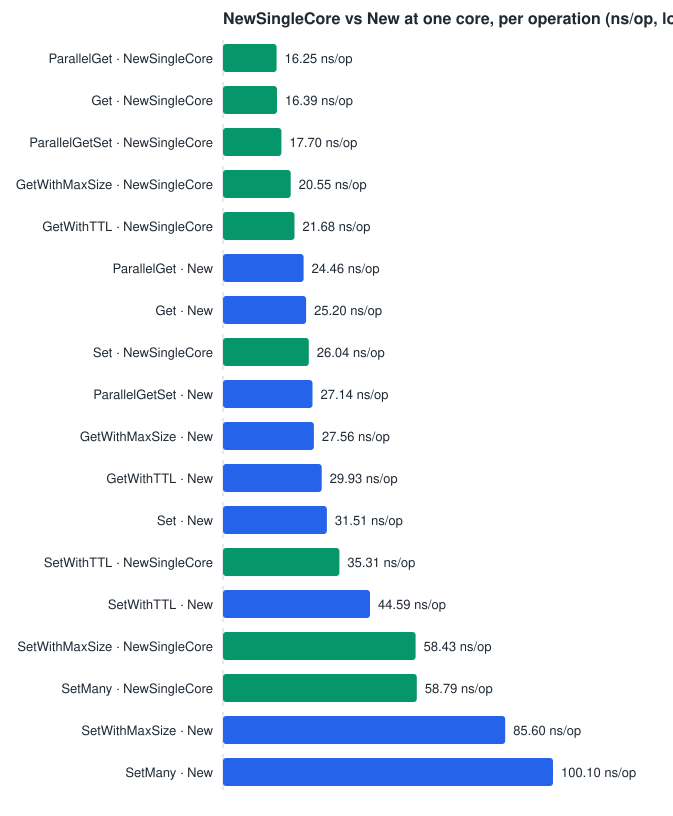

The two largest wins were not the predicted ones. `DeleteManyRepeated` (-89%) and `SetManyRepeated` (-63%) come from there being nothing to group: with one shard the whole bulk-grouping machinery [docs/adr/0022](docs/adr/0022-bulk-bucket-scratch-reuse.md) exists to amortize disappears rather than being amortized.

The `EvictionChurn*` rows answer the open question about putting the entire eviction budget in one CLOCK ring instead of 256. Even `EvictionChurnHot` — every reference bit pre-set, CLOCK's worst case — is *cheaper* here (131.3 vs 142.8), confirming [docs/adr/0023](docs/adr/0023-reject-clock-bitmap.md)'s finding that the sweep is not where bounded-cache cost lives.

#### The trade, stated plainly

With two or more cores, `New` pulls ahead immediately and keeps improving as cores are added, while `NewSingleCore`'s one lock becomes the bottleneck — the same shape go-cache has in the table above. **If you declare single-core and then run on many cores, you get one global lock and you will feel it.** When in doubt, use `New`.

Choosing at run time requires the `Cacher[K, V]` interface, whose dynamic dispatch is not free: measured at 24.45 → 26.58 ns/op (+8.7%) on `Get` through the interface versus the concrete type. That is exactly why `New` and `NewSingleCore` return concrete types — nobody pays it unless they ask for it. Full reasoning and the rejected alternatives are in [docs/adr/0026](docs/adr/0026-single-core-cache.md).

## Comparison with other Go cache libraries

Benchmarked head-to-head in `bench/` (a separate module — see `bench/go.mod` — so these comparison-only dependencies never leak into consumers of goache). Run: `cd bench && go test -bench=. -benchmem -run=^$ ./...`

Against:

- **[patrickmn/go-cache](https://github.com/patrickmn/go-cache)** — naive baseline: single global `RWMutex`, values boxed as `interface{}`.
- **[coocood/freecache](https://github.com/coocood/freecache)** — sharded, GC-avoiding cache (`[]byte`-only keys/values, no generics).
- **[dgraph-io/ristretto/v2](https://github.com/dgraph-io/ristretto)** — industry-standard cache with TinyLFU admission control and async, best-effort `Set`.
- **[Yiling-J/theine-go](https://github.com/Yiling-J/theine-go)** — Caffeine-inspired cache with adaptive W-TinyLFU admission and a hierarchical timer wheel for TTL. Requires a bounded `MaximumSize` up front (no unbounded mode) and an explicit per-entry cost on `Set`.
- **[maypok86/otter/v2](https://github.com/maypok86/otter)** — also Caffeine-inspired (adaptive W-TinyLFU as of v2); its author documents it as having had "long-standing unbeatable throughput" among Go caches even in its v1 S3-FIFO incarnation.

See [docs/competitor-analysis.md](docs/competitor-analysis.md) for what each library trades off qualitatively, and [docs/adr/0017-size-parametrized-benchmarks.md](docs/adr/0017-size-parametrized-benchmarks.md) for the benchmark methodology below: every category runs at five working-set sizes (1,000 / 5,000 / 50,000 / 100,000 / 1,000,000 entries), and covers every feature goache has an equivalent for — not just the unbounded Set/Get/ParallelGet baseline, but per-entry TTL, `Delete` (measured as delete-then-reinsert churn — see the ADR for why), and bounded/eviction behavior (for the libraries that have a comparable size-bounded eviction knob: goache's `WithMaxSize`, theine, otter, ristretto — go-cache has no eviction and freecache bounds by byte size, not entry count, so neither has one).

Machine: AMD Ryzen AI 9 HX 370 (24 threads), Go 1.26.2. All tables are ns/op, lower is better. **Mixed provenance, noted for transparency**: the five competitor libraries' numbers are from a single clean run (no other work running in parallel on this machine while it executed — see [docs/adr/0017](docs/adr/0017-size-parametrized-benchmarks.md)'s update on why that matters: two independent clean runs of this exact suite produced meaningfully different numbers for ristretto and theine specifically, discussed in the takeaways below). goache's own rows were re-measured afterward, alone (`go test -bench='^BenchmarkGoache_'`), after [docs/adr/0018](docs/adr/0018-gemini-analysis-experiments.md)'s changes to `cache.go` — only goache's implementation changed, the competitor libraries and their code didn't, so re-running just goache's benchmarks to refresh its own rows is valid without re-running the full comparison; but this does mean goache's cells and the other five libraries' cells were measured in separate runs, not the same one.

### Set

| Library | 1,000 | 5,000 | 50,000 | 100,000 | 1,000,000 |
|---|---|---|---|---|---|
| goache | 27.91 | 23.78 | 28.72 | 32.63 | 127.2 |
| go-cache | 28.27 | 30.07 | 35.28 | 39.11 | 130.6 |
| freecache | 35.83 | 36.63 | 59.13 | 86.50 | 187.0 |
| otter | 139.7 | 130.7 | 133.2 | 137.6 | 225.8 |
| theine | 157.1 | 158.0 | 176.2 | 200.4 | 413.0 |
| ristretto | 223.7 | 236.4 | 240.5 | 287.4 | 362.3 |


### Get

| Library | 1,000 | 5,000 | 50,000 | 100,000 | 1,000,000 |
|---|---|---|---|---|---|
| go-cache | 12.94 | 12.56 | 15.79 | 17.40 | 70.39 |
| goache | 22.77 | 16.67 | 21.01 | 23.84 | 87.98 |
| otter | 34.71 | 35.01 | 37.89 | 40.79 | 149.2 |
| ristretto | 42.59 | 41.93 | 61.51 | 79.35 | 178.5 |
| freecache | 47.67 | 48.57 | 72.66 | 108.4 | 208.3 |
| theine | 87.17 | 86.33 | 111.6 | 132.1 | 286.4 |

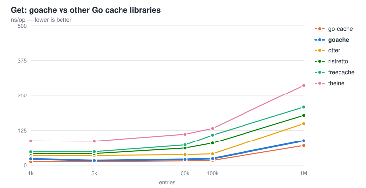

### ParallelGet

| Library | 1,000 | 5,000 | 50,000 | 100,000 | 1,000,000 |
|---|---|---|---|---|---|
| goache | 5.673 | 4.573 | 4.235 | 4.578 | 9.250 |
| otter | 3.262 | 6.722 | 7.479 | 5.980 | 9.934 |
| theine | 5.258 | 5.220 | 5.978 | 6.324 | 10.52 |
| ristretto | 9.079 | 8.217 | 7.534 | 8.674 | 10.88 |
| freecache | 14.59 | 14.95 | 15.39 | 15.66 | 17.59 |
| go-cache | 36.74 | 37.01 | 37.05 | 36.61 | 38.42 |


### SetWithTTL

otter has no per-`Set` TTL argument — it configures a fixed write-based expiry policy at construction instead (`ExpiryWriting`); its numbers here use that, documented in `bench/compare_test.go`'s `newOtterTTL`.

| Library | 1,000 | 5,000 | 50,000 | 100,000 | 1,000,000 |
|---|---|---|---|---|---|
| goache | 35.33 | 30.91 | 37.67 | 42.10 | 171.7 |
| go-cache | 34.41 | 36.26 | 46.66 | 51.80 | 201.2 |
| freecache | 36.32 | 38.01 | 63.18 | 88.99 | 194.8 |
| otter | 159.2 | 159.2 | 168.8 | 174.2 | 260.6 |
| theine | 181.6 | 176.5 | 207.0 | 261.3 | 420.2 |
| ristretto | 248.2 | 253.1 | 299.5 | 372.8 | 441.2 |

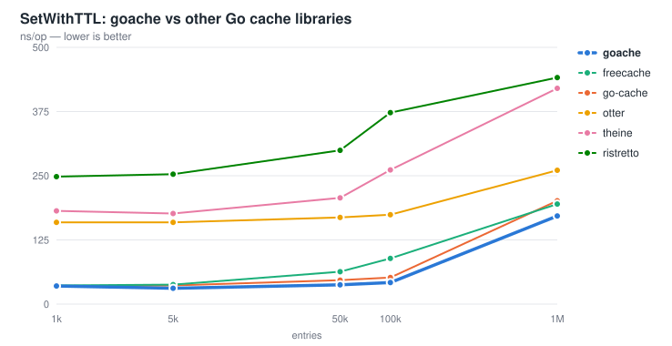

### GetWithTTL

| Library | 1,000 | 5,000 | 50,000 | 100,000 | 1,000,000 |
|---|---|---|---|---|---|
| go-cache | 14.10 | 14.98 | 20.59 | 22.70 | 94.21 |
| goache | 28.26 | 21.08 | 26.07 | 28.35 | 93.24 |
| otter | 47.96 | 50.17 | 54.57 | 59.86 | 163.2 |
| ristretto | 47.16 | 46.00 | 58.42 | 94.23 | 187.8 |
| freecache | 47.64 | 48.50 | 74.35 | 106.1 | 211.9 |
| theine | 86.90 | 83.13 | 103.1 | 136.0 | 287.9 |

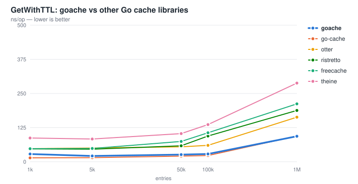

### Delete (measured as delete-then-reinsert churn, not isolated deletion — see the ADR)

| Library | 1,000 | 5,000 | 50,000 | 100,000 | 1,000,000 |
|---|---|---|---|---|---|
| go-cache | 53.64 | 58.12 | 68.42 | 72.00 | 191.4 |
| goache | 65.60 | 64.54 | 82.52 | 87.69 | 198.0 |
| freecache | 83.20 | 102.9 | 159.0 | 200.4 | 274.5 |
| otter | 225.0 | 226.0 | 243.7 | 257.1 | 361.5 |
| theine | 408.9 | 418.1 | 431.3 | 492.9 | 583.1 |
| ristretto | 485.0 | 471.8 | 514.6 | 537.1 | 649.0 |

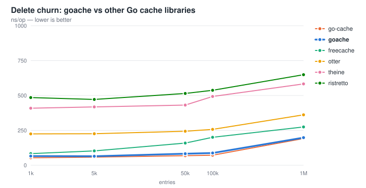

### Bounded (Set against a cache actively evicting — limit = n/2; go-cache and freecache have no comparable mode, see above)

| Library | 1,000 | 5,000 | 50,000 | 100,000 | 1,000,000 |
|---|---|---|---|---|---|
| goache | 47.52 | 61.31 | 69.12 | 110.4 | 269.8 |
| otter | 140.9 | 131.3 | 156.1 | 159.9 | 237.3 |
| ristretto | 125.5 | 108.6 | 104.0 | 89.94 | 76.34 |
| theine | 199.4 | 190.3 | 184.8 | 233.1 | 347.5 |

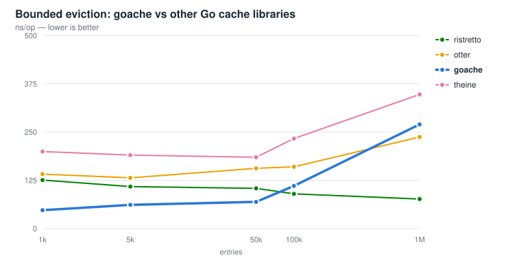

Takeaways:

- **Every library's single-threaded `Get` degrades noticeably from 1,000 to 1,000,000 entries** (go-cache 12.94→70.39, goache 22.77→87.98, otter 34.71→149.2, ristretto 42.59→178.5, theine 87.17→286.4) — a universal effect of the working set outgrowing CPU cache, not specific to any one library's design. goache's *relative* degradation is in line with everyone else's, and its *absolute* numbers stay competitive throughout.
- **Under real concurrency, sharded/striped designs hold their ground at every size**: goache, otter, and theine all stay roughly in the 4-11 ns/op range even at 1,000,000 entries, while go-cache's single global lock is essentially flat regardless of size (36.7 → 38.4 ns/op) — it was never bottlenecked by cache size, only by lock contention, and that bottleneck doesn't change no matter how big the map gets. This is the sharding argument playing out exactly as designed, confirmed at 1,000x the original single-size comparison's scale.
- **goache now leads `ParallelGet` at every size except n=1,000** (see the reordered table above), after padding each shard to a cache line to remove false sharing between adjacent shards ([docs/adr/0018](docs/adr/0018-gemini-analysis-experiments.md)) — previously it trailed both otter and theine at most sizes.
- **Delete churn is now allocation-free and second only to go-cache**: the per-shard freelist ([docs/adr/0019](docs/adr/0019-single-slot-freelist.md)) dropped goache's row from 93.27-220.5 to 65.60-198.0 ns/op, overtaking freecache at every size (previously goache lost to it up to n=100,000). The remaining gap to go-cache is structural — the churn cycle pays goache's shard-routing hash twice per iteration, the price of the sharding that wins `ParallelGet`.
- **ristretto and theine show real, substantial run-to-run variance — enough to flip a conclusion.** Re-running this exact suite (same machine, same code, a clean wait with no other work in parallel — see [docs/adr/0017](docs/adr/0017-size-parametrized-benchmarks.md)) moved theine's `Set` at n=1,000 from 271.7 to 157.1 ns/op (a ~42% swing) and, more importantly, **flipped ristretto's `Bounded` scaling trend**: the first run showed it essentially flat (111.6→117.8 ns/op, 1,000→1,000,000), this run shows it clearly *decreasing* with size (125.5→76.34 ns/op). goache, go-cache, freecache, and otter's numbers stayed consistent across both runs. The most plausible explanation is that ristretto's and theine's own internal async machinery (ristretto's buffered-write goroutines, theine's timer wheel and background maintenance) makes them more sensitive to scheduler noise than the synchronous libraries — meaning single-run comparisons involving those two specifically should be read as directional, not precise, and any conclusion drawn from one run of their numbers deserves a second run before being trusted.
- **goache's `WithMaxSize` eviction cost still grows with cache size** (the "Bounded" table): 47.52 ns/op at 1,000 entries to 269.8 ns/op at 1,000,000, roughly 5.7x — still matches [ADR 0016](docs/adr/0016-clock-eviction.md)'s locality-regression finding (goache's CLOCK ring is an intrusive per-shard linked list of individually heap-allocated entries, so a bigger shard means a bigger, more cache-unfriendly ring to walk), though the absolute numbers at smaller/mid sizes dropped substantially (roughly 35-40% at n=1,000-100,000) after gating `sync.Pool` entry recycling to `WithMaxSize`-bounded shards ([docs/adr/0018](docs/adr/0018-gemini-analysis-experiments.md)) — the pooling win shrinks at n=1,000,000, converging back to roughly the old number, which is itself worth noting rather than glossing over. Given the variance noted above, whether competitors' bounded-eviction cost scales better is genuinely unclear from this data — ristretto's own numbers moved in opposite directions between two clean runs — but goache's own upward trend is the one solid, reproduced finding here. **Raising the shard count does not fix it**: measured across 256/512/1024/2048/4096 shards, bounded eviction got *worse* with more shards at the sizes that matter (+25% at n=100,000, +19% at n=1,000,000), so `WithShardCount` is not the knob to reach for here — see [docs/adr/0020](docs/adr/0020-shard-count-does-not-scale-eviction.md).
- **`Set`**: goache is fastest at every size up to 100,000, and the only zero-allocation `Set` for repeated keys (see "Automatic eviction" above for the cold-insert cost `WithMaxSize` support added). Every admission-policy cache (theine, otter, ristretto) pays for eviction-policy bookkeeping on every `Set` — the trade goache's default (no eviction) opts out of.
- **ristretto's `Set` is asynchronous and best-effort** (values can be dropped by its admission policy) — a materially different contract than goache's synchronous, always-succeeds `Set`. Not a drop-in semantic replacement, but included since it's the most commonly reached-for high-performance Go cache today.
- **theine and otter are not drop-in semantic replacements either**: both implement W-TinyLFU admission/eviction, meaning `Set` can be a no-op if the entry loses the admission race — goache's `Set` always lands, whether or not `WithMaxSize` is configured; a full shard evicts something else to make room rather than rejecting the incoming write. Pick goache when you want guaranteed writes with a size bound whose cost is at least predictable (even if it grows with scale); pick theine/otter/ristretto when you need a hit-ratio-optimizing admission policy (better under skewed access patterns) and can accept probabilistic admission — and budget for their benchmark numbers being noisier run-to-run than goache's own.
