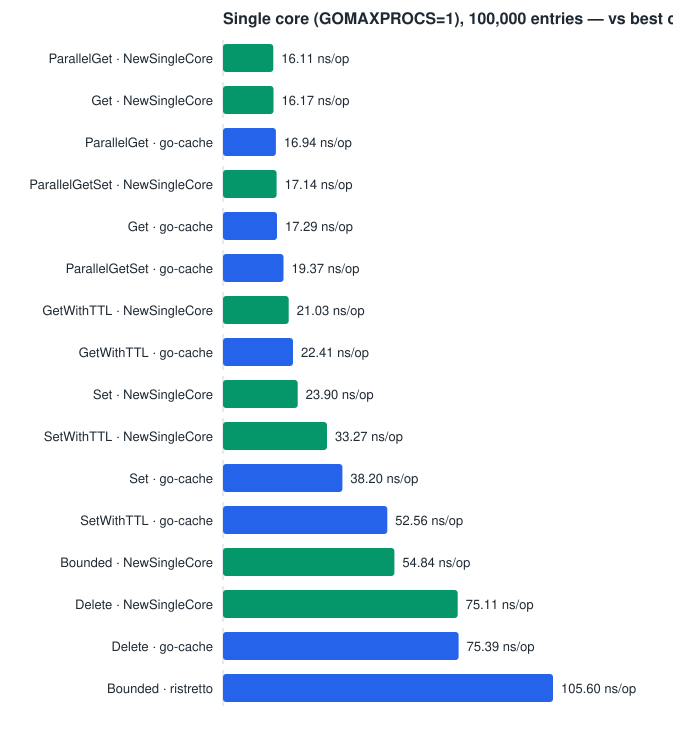

# goache

Fast golang based cache system. Generic, sharded, goroutine-safe. Optimized for low latency, zero-allocation hot paths, and low memory overhead.

## When goache is the right choice

goache is built for **concurrent, write-heavy caching where every write must land**. Every claim below is a measured number from the [benchmarks](#benchmarks) further down, against five other Go cache libraries at working sets from 1,000 to 1,000,000 entries.

**Reach for goache when:**

- **Many goroutines hit the cache at once, *and the process has at least two cores*.** This is the case goache is built around: at 100,000 entries a concurrent `Get` costs **4.58 ns/op vs go-cache's 36.61**, an 8x difference that comes from sharding instead of one global lock. go-cache stays pinned near 37 ns/op at *every* size — its bottleneck was never cache size, only lock contention. Among the sharded libraries goache is fastest at every size but the smallest, where otter leads (3.26 vs 5.67 ns/op at 1,000 entries). The core-count condition is not a formality: on a single core sharding buys nothing, and `New` is the wrong constructor there — use [`NewSingleCore`](benchmarks/README.md#single-core-mode-newsinglecore) instead.
- **The workload writes as much as it reads.** goache leads plain `Set` at *every* size measured (32.63 ns/op at 100,000 entries; next best go-cache 39.11, then freecache 86.50, otter 137.6, theine 200.4, ristretto 287.4) and leads `SetWithTTL` at every size from 5,000 entries up (go-cache edges it by 0.9 ns/op at 1,000).
- **A dropped write would be a bug.** Every `Set` is applied synchronously before it returns. ristretto — the fastest library here at very large bounded sizes — explicitly may discard writes under pressure; goache never does.
- **You need a hard memory ceiling.** `WithMaxSize(n)` is an exact upper bound, not an approximation: the budget is split so per-shard limits sum to exactly n, and `Len()` can never exceed it ([docs/adr/0020](docs/adr/0020-shard-count-does-not-scale-eviction.md)).
- **Bounded caches up to ~50,000 entries.** goache leads eviction cost through that range (47.52 / 61.31 / 69.12 ns/op at 1k / 5k / 50k). See the caveat below for larger bounds.
- **Bulk writes against a live cache.** Repeated `SetMany`/`DeleteMany` are completely allocation-free ([docs/adr/0022](docs/adr/0022-bulk-bucket-scratch-reuse.md)).
- **You want typed keys and values with no dependencies.** Full generics, no `interface{}` boxing, and goache's own module has zero external dependencies — the comparison libraries live in a [separate module](bench/) so they never reach your build.
- **The process runs on exactly one core** — a Kubernetes pod at `limits.cpu: 1000m` or below, under Go 1.25+. Use [`NewSingleCore`](benchmarks/README.md#single-core-mode-newsinglecore), not `New`. At 100,000 entries it is the fastest of the seven caches measured here in all eight benchmark categories, though the margin is honest about its shape: -37% to -48% on writes and bounded eviction, only -4.9% to -6.5% on reads, and a dead tie with go-cache on delete-then-reinsert churn.

**Reach for something else when:**

- **The cache is read almost exclusively from one goroutine.** `New`'s sharding pays for a shard hash and one pointer hop that only earn their keep once goroutines compete: go-cache's `Get` beats it at every size (17.40 vs 23.84 ns/op at 100,000), and the same trade shows up in delete-then-reinsert churn at every size and in `GetWithTTL` up to 100,000 entries (past that goache edges ahead, 93.24 vs 94.21 at 1,000,000). This is an argument against `New`, not against goache — [`NewSingleCore`](benchmarks/README.md#single-core-mode-newsinglecore) drops the sharding and wins that comparison instead.
- **Hit ratio under heavily skewed access matters more than throughput.** goache uses CLOCK (second-chance), deliberately chosen to keep `Get` write-lock-free ([docs/adr/0016](docs/adr/0016-clock-eviction.md)). theine and otter use W-TinyLFU, which keeps a better hit ratio on Zipf-like workloads. goache makes no hit-ratio claim; if that is your bottleneck, measure them.
- **You need a bounded cache of ~100,000+ entries under constant eviction.** ristretto's admission scales better there (89.94 ns/op at 100,000 and 76.34 at 1,000,000, vs goache's 110.4 and 269.8) — if you accept that it may drop writes to get it. Note ristretto's numbers in this category moved substantially between two clean runs, so treat them as directional ([docs/adr/0017](docs/adr/0017-size-parametrized-benchmarks.md)).
- **You need loading/stampede protection, hit-miss statistics, persistence, or a disk tier today.** None are implemented — they are tracked in [docs/roadmap.md](docs/roadmap.md), and theine, otter or sturdyc cover them now.
- **You cache raw bytes at a scale where GC pressure dominates.** freecache stores everything off-heap in a byte ring buffer, which goache's typed on-heap design does not attempt.

[docs/competitor-analysis.md](docs/competitor-analysis.md) has the qualitative comparison behind these numbers.

## Install

```
go get github.com/Nerzal/goache
```

**Requires Go 1.25 or later**, and goache has no dependencies of its own. The floor is 1.25 for two reasons: `hash/maphash.Comparable` (1.24) is how keys are hashed without reflection or per-key allocation, and 1.25 is where the runtime began deriving `GOMAXPROCS` from the cgroup CPU quota — the behaviour `NewSingleCore` exists for.

## Usage

```go
c := goache.New[string, int]()

c.Set("a", 1)
v, ok := c.Get("a") // 1, true

c.SetMany([]goache.Entry[string, int]{
    {Key: "b", Value: 2},
    {Key: "c", Value: 3},
})

// Know roughly how many items you're loading upfront? Pre-size to skip
// Go's incremental map growth entirely — see Benchmarks below.
c2 := goache.New[string, int](goache.WithCapacity(10000))

// Entries can optionally expire. Plain Set/Get never touch the clock —
// only entries actually given a TTL pay for one, see Benchmarks below.
c.SetWithTTL("request-count", 1, 5*time.Minute)

c.SetMany([]goache.Entry[string, int]{
    {Key: "d", Value: 4, TTL: time.Minute}, // expires in a minute
    {Key: "e", Value: 5},                   // no TTL: TTL zero value = never expires
})

// Expired entries are hidden by Get automatically, but not reclaimed until
// something overwrites the key or Purge is called — goache runs no
// background goroutines of its own. Call this periodically if you use TTLs
// and want expired keys' memory reclaimed promptly.
removed := c.Purge()

// Remove entries explicitly, single or bulk.
c.Delete("a")
c.DeleteMany([]string{"b", "c"})

// Drop everything at once; the cache is still usable afterwards.
c.Clear()

// Bound the cache to at most n entries instead of growing forever. Once a
// shard is full, Set evicts via CLOCK (a second-chance approximation of
// LRU) — see Benchmarks below and docs/adr/0016-clock-eviction.md for why
// CLOCK and what it costs.
c3 := goache.New[string, int](goache.WithMaxSize(100_000))
```

Running on a single core — a Kubernetes pod at `limits.cpu: 1000m` or below, where Go 1.25+ sets `GOMAXPROCS=1` — use `NewSingleCore` instead. Same API, same options, no sharding:

```go
c := goache.NewSingleCore[string, int]()          // same methods as above
c2 := goache.NewSingleCore[string, int](goache.WithMaxSize(100_000))

// Deciding at startup from the runtime's own view of the CPU budget needs
// one variable that can hold either type — that's what Cacher is for. Its
// dynamic dispatch costs ~2 ns per call, so prefer keeping the concrete
// type when you can.
var cache goache.Cacher[string, int]
if runtime.GOMAXPROCS(0) == 1 {
    cache = goache.NewSingleCore[string, int]()
} else {
    cache = goache.New[string, int]()
}
```

`WithShardCount` is meaningless to `NewSingleCore` and ignored, so one shared `[]goache.Option` can be passed to either constructor. See [Single-core mode](benchmarks/README.md#single-core-mode-newsinglecore) for the numbers and the crossover point.

Every snippet above has a runnable counterpart in [`example_test.go`](example_test.go) — `ExampleNew`, `ExampleNew_withCapacity`, `ExampleNew_withMaxSize`, `ExampleCache_SetMany`, `ExampleCache_Purge`, `ExampleCache_DeleteMany`, `ExampleNewSingleCore`, `ExampleCacher` and two more. They run under `make test` and are checked against their `// Output:` comments, so a change that breaks a documented usage pattern fails CI instead of quietly rotting here and on pkg.go.dev.

## Architecture

`Cache[K comparable, V any]` shards keys across N independently-locked segments (`sync.RWMutex` per shard, `hash/maphash.Comparable` for routing) instead of one global lock or `sync.Map`. See the package doc comment in `cache.go` for the full reasoning, including why Go's experimental `arena` package was evaluated and rejected for this phase, and a log of optimizations that were tried and measured — some kept (cache-line-padded contiguous shard storage, entry recycling on bounded shards), several reverted and documented so they aren't re-attempted blind (a custom open-addressed per-shard table replacing Go's map, and three more in [docs/adr/0018](docs/adr/0018-gemini-analysis-experiments.md)).

`SingleCoreCache[K comparable, V any]` (via `NewSingleCore`) is a second, independent implementation of the same operations for processes that run on one core: one map behind one `sync.RWMutex`, no shard routing, no per-entry eviction metadata unless `WithMaxSize` is set. It exists because a branch inside `Cache` was built, measured, and found insufficient — the sharded path is left completely untouched by it, so it cannot regress. See [docs/adr/0026](docs/adr/0026-single-core-cache.md), which also records why returning an interface from `New` was rejected on measurement.

Phase 1 scope: `Set`, `SetMany`, `Get`, `Delete`, `DeleteMany`, `Clear`, `WithCapacity` (pre-sizing). Phase 2: optional per-entry TTL via `SetWithTTL`/`Entry.TTL`, lazily enforced in `Get`, reclaimed via the caller-driven `Purge` — no background goroutine (see docs/adr/0011) — plus bounded automatic eviction via `WithMaxSize`, using a per-shard CLOCK (second-chance) policy chosen specifically so `Get` never needs a write lock to track recency (see docs/adr/0016). Remaining roadmap items (loading cache, stampede protection, stats) are tracked in [docs/roadmap.md](docs/roadmap.md).


## Benchmarks

**The full record — goache's own numbers, every competitor, every category, at five working-set sizes and five core counts — is in [benchmarks/README.md](benchmarks/README.md).** This section keeps the three comparisons that decide which cache to reach for.

Run them with `make bench-compare` (24 threads), `make bench-compare-cpu` (across core counts) and `make bench-compare-singlecore` (at one core). Machine for every number below: AMD Ryzen AI 9 HX 370 (24 threads), Go 1.26.2, ns/op, lower is better.

Read [How these numbers are measured](benchmarks/README.md#how-these-numbers-are-measured) before comparing any two of them — two comparisons in this project's history came out backwards before being caught.

### Concurrent reads, by available cores

The comparison that decides the choice, because the answer changes with the CPU budget. Concurrent `Get`, 100,000 entries. The `goache` row is the sharded `Cache` at every column, so the core-count effect is visible on one implementation:

| Library | 1 core | 2 | 4 | 8 | 24 |
|---|---|---|---|---|---|
| go-cache | **16.88** | 25.50 | 17.56 | 27.29 | 37.41 |
| goache (`New`) | 24.51 | **14.08** | **7.399** | 7.587 | 4.687 |
| otter | 34.38 | 24.86 | 9.695 | **5.899** | **3.924** |
| ristretto | 37.31 | 32.37 | 16.10 | 15.99 | 8.211 |
| freecache | 103.7 | 52.92 | 27.16 | 26.02 | 16.18 |
| theine | 133.5 | 81.79 | 75.17 | 12.57 | 6.443 |


**`New` is not the fastest choice on a single core — go-cache is, by 45%.** Its one global mutex is uncontended when only one goroutine can run, so it pays nothing for locking and nothing for a shard hash. That inverts immediately: at two cores `New` costs 45% *less*, and by 24 cores it is 8x cheaper, because go-cache's single lock gets worse with every core added while goache's cost keeps falling. **For the leftmost column, use `NewSingleCore` — the next table.**

### At one core: `NewSingleCore` against the whole field

n=100,000, `-cpu=1`, `-count=10`, benchstat medians. Every category `NewSingleCore` has an equivalent for, against whichever library is fastest in it:

| Benchmark | `NewSingleCore` | Best competitor | Lead |
|---|---|---|---|
| `Bounded` (limit = n/2) | **54.84** ± 0% | ristretto 105.6 ± 6% | **-48%** |
| `Set` | **23.90** ± 1% | go-cache 38.20 ± 3% | **-37%** |
| `SetWithTTL` | **33.27** ± 1% | go-cache 52.56 ± 2% | **-37%** |
| `ParallelGetSet` (90/10) | **17.14** ± 0% | go-cache 19.37 ± 1% | -11.5% |
| `Get` | **16.17** ± 0% | go-cache 17.29 ± 2% | -6.5% |
| `GetWithTTL` | **21.03** ± 0% | go-cache 22.41 ± 1% | -6.2% |
| `ParallelGet` | **16.11** ± 1% | go-cache 16.94 ± 1% | -4.9% |
| `Delete` (churn) | **75.11** ± 0% | go-cache 75.39 ± 1% | -0.4% (tie) |



**Fastest of the seven in all eight categories.** Two caveats, both against goache: the read leads are thin (4.9-6.5%, not the 20-25% an earlier `-count=3` measurement claimed), and `Delete` is a tie rather than a win. The large leads are on writes, where go-cache boxes every value as `interface{}`. One documented exception, and it is against goache's own sharded cache rather than a competitor: **with `WithMaxSize` under ~10,000 entries, `New` evicts faster even at one core.** All of it in [benchmarks/README.md](benchmarks/README.md#single-core-mode-newsinglecore) and [ADR 0027](docs/adr/0027-single-core-field-claim.md).

### Concurrent reads at 24 threads, by working-set size

Where sharding pays. `ParallelGet`, ns/op:

| Library | 1,000 | 5,000 | 50,000 | 100,000 | 1,000,000 |
|---|---|---|---|---|---|
| goache | 5.673 | 4.573 | 4.235 | 4.578 | 9.250 |
| otter | 3.262 | 6.722 | 7.479 | 5.980 | 9.934 |
| theine | 5.258 | 5.220 | 5.978 | 6.324 | 10.52 |
| ristretto | 9.079 | 8.217 | 7.534 | 8.674 | 10.88 |
| freecache | 14.59 | 14.95 | 15.39 | 15.66 | 17.59 |
| go-cache | 36.74 | 37.01 | 37.05 | 36.61 | 38.42 |


goache leads at every size except n=1,000, after padding each shard to a cache line to remove false sharing between adjacent shards' mutexes ([ADR 0018](docs/adr/0018-gemini-analysis-experiments.md)). go-cache's single global lock is flat regardless of size — it was never bottlenecked by cache size, only by contention, and that does not change however big the map gets.

### What is not on this page

goache's own numbers (`Set`/`Get`/`SetMany`/`Purge`/`Clear`, `WithCapacity` pre-sizing, TTL overhead, eviction cost), the remaining six cross-library categories at all five sizes, the per-library single-core matrix, the bounded-eviction crossover, and the decomposition of where a `Get`'s 16 ns actually goes — all in [benchmarks/README.md](benchmarks/README.md).
