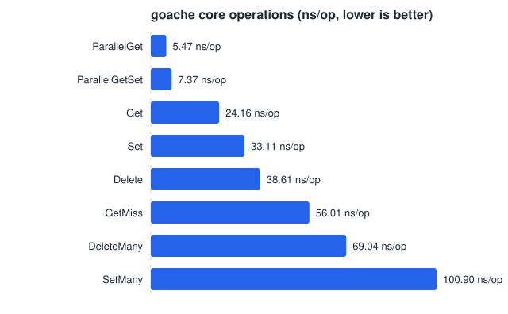
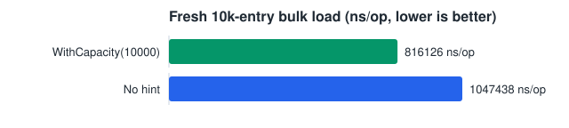
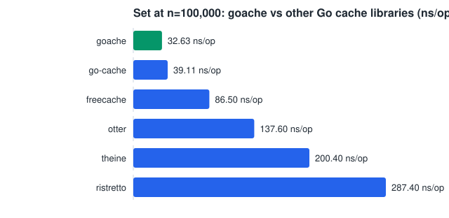
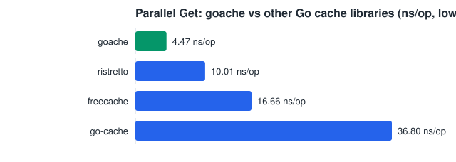

# goache

Fast golang based cache system. Generic, sharded, goroutine-safe. Optimized for low latency, zero-allocation hot paths, and low memory overhead.

## Install

```
go get github.com/Nerzal/goache
```

## Usage

```go
c := goache.New[string, int]()

c.Set("a", 1)
v, ok := c.Get("a") // 1, true

c.SetMany([]goache.Entry[string, int]{
    {Key: "b", Value: 2},
    {Key: "c", Value: 3},
})

// Know roughly how many items you're loading upfront? Pre-size to skip
// Go's incremental map growth entirely — see Benchmarks below.
c2 := goache.New[string, int](goache.WithCapacity(10000))
```

## Architecture

`Cache[K comparable, V any]` shards keys across N independently-locked segments (`sync.RWMutex` per shard, `hash/maphash.Comparable` for routing) instead of one global lock or `sync.Map`. See the package doc comment in `cache.go` for the full reasoning, including why Go's experimental `arena` package was evaluated and rejected for this phase, and two optimizations that were tried and measured as regressions (a contiguous shard-value-slice layout, and a custom open-addressed per-shard table replacing Go's map) — both reverted, kept only as documented lessons.

Phase 1 scope: `Set`, `SetMany`, `Get`, `WithCapacity` (pre-sizing). No eviction/TTL yet (planned for phase 2).

## Benchmarks

Run: `make bench` (or `go test -bench=. -benchmem -run=^$ ./...`). Charts below are regenerated with `make charts` after updating the numbers in this file — see `docs/benchcharts/main.go`.

Last measured on AMD Ryzen AI 9 HX 370 (24 threads), Go 1.26.2:

```
BenchmarkSet-24               39917725    29.76 ns/op     0 B/op   0 allocs/op
BenchmarkSetMany-24           14209136    84.56 ns/op   266 B/op   1 allocs/op
BenchmarkGet-24               54645056    22.53 ns/op     0 B/op   0 allocs/op
BenchmarkGetMiss-24           19998666    57.72 ns/op     7 B/op   0 allocs/op
BenchmarkParallelGetSet-24   153717307     7.793 ns/op    0 B/op   0 allocs/op
BenchmarkParallelGet-24      280135519     4.399 ns/op    0 B/op   0 allocs/op
```

`Set`/`Get` are zero-allocation on the hot path. `SetMany`'s single alloc/op comes from its per-call shard-bucket grouping (scales with shard count, not batch size); `GetMiss`'s alloc is the benchmark's own key-string construction, not the cache.



### Ingestion: `WithCapacity` pre-sizing

Bulk-loading a fresh cache when the final size is roughly known upfront (`BenchmarkFreshLoad_*`, 10k entries via `SetMany` into a brand-new `Cache`):

```
BenchmarkFreshLoad_NoHint-24              1509    793654 ns/op   1579119 B/op   4232 allocs/op
BenchmarkFreshLoad_WithCapacityHint-24    2589    475442 ns/op   1192161 B/op   2973 allocs/op
```



`WithCapacity` pre-sizes every shard's map so bulk inserts skip Go's incremental map growth/rehashing almost entirely: **~38% faster, ~25% fewer allocations, ~25% less memory** for a fresh bulk load. Use it whenever you know the approximate final size upfront (e.g. loading a fixed data set at startup).

## Comparison with other Go cache libraries

Benchmarked head-to-head in `bench/` (a separate module — see `bench/go.mod` — so these comparison-only dependencies never leak into consumers of goache). Run: `cd bench && go test -bench=. -benchmem -run=^$ ./...`

Same workload (string keys, int values, 100k-key working set) against:

- **[patrickmn/go-cache](https://github.com/patrickmn/go-cache)** — naive baseline: single global `RWMutex`, values boxed as `interface{}`.
- **[coocood/freecache](https://github.com/coocood/freecache)** — sharded, GC-avoiding cache (`[]byte`-only keys/values, no generics).
- **[dgraph-io/ristretto/v2](https://github.com/dgraph-io/ristretto)** — industry-standard cache with TinyLFU admission control and async, best-effort `Set`.

Last measured on AMD Ryzen AI 9 HX 370 (24 threads), Go 1.26.2:

```
BenchmarkGoache_Set-24              40074636    29.72 ns/op     0 B/op   0 allocs/op
BenchmarkGoache_Get-24              53578364    22.17 ns/op     0 B/op   0 allocs/op
BenchmarkGoache_ParallelGet-24     259776189     4.470 ns/op    0 B/op   0 allocs/op

BenchmarkGoCache_Set-24             27361424    43.14 ns/op     8 B/op   1 allocs/op
BenchmarkGoCache_Get-24             66061470    19.85 ns/op     0 B/op   0 allocs/op
BenchmarkGoCache_ParallelGet-24     32205513    36.80 ns/op     0 B/op   0 allocs/op

BenchmarkFreecache_Set-24            7369866   146.2 ns/op      2 B/op   0 allocs/op
BenchmarkFreecache_Get-24            6425013   174.3 ns/op      8 B/op   1 allocs/op
BenchmarkFreecache_ParallelGet-24   69028594    16.66 ns/op      8 B/op   1 allocs/op

BenchmarkRistretto_Set-24            3619807   353.8 ns/op     85 B/op   1 allocs/op
BenchmarkRistretto_Get-24            7817079   150.4 ns/op      7 B/op   0 allocs/op
BenchmarkRistretto_ParallelGet-24  100000000    10.01 ns/op      0 B/op   0 allocs/op
```





Takeaways:

- **Parallel reads**: goache is fastest by a clear margin (4.47 ns/op) — ~8x faster than go-cache's single global lock (36.8 ns/op), ~2.2x faster than ristretto's admission-controlled path (10.0 ns/op), ~3.7x faster than freecache (16.7 ns/op). This is the payoff of lock-striping under real concurrent load.
- **Single-threaded Get**: go-cache edges out goache slightly (19.85 vs 22.17 ns/op) — an uncontended single global mutex has less overhead than hashing a key to pick a shard. Sharding's benefit only shows up under concurrency, which is the workload this cache is designed for.
- **Set**: goache is fastest and the only zero-allocation `Set` in the comparison. freecache and ristretto both pay for GC-avoidance or admission-control bookkeeping (byte-copying into ring buffers / cost-tracking), and go-cache pays for boxing into `interface{}`.
- **ristretto's `Set` is asynchronous and best-effort** (values can be dropped by its admission policy) — a materially different contract than goache's synchronous, always-succeeds `Set`. Not a drop-in semantic replacement, but included since it's the most commonly reached-for high-performance Go cache today.
