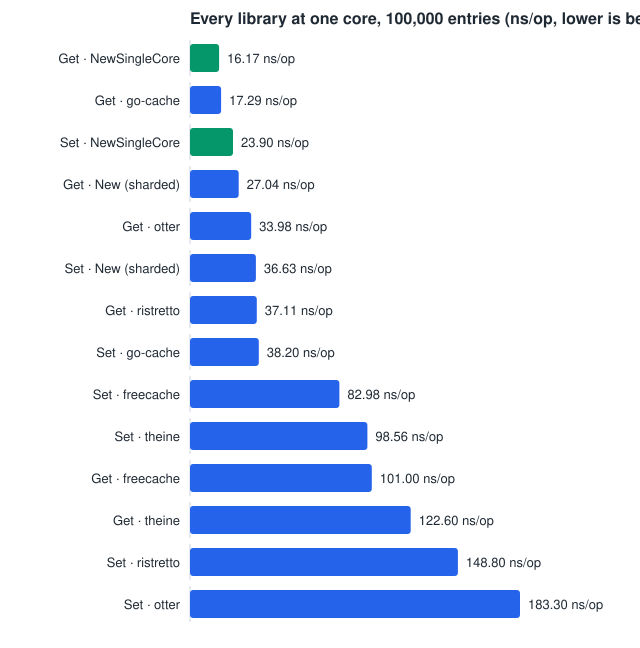
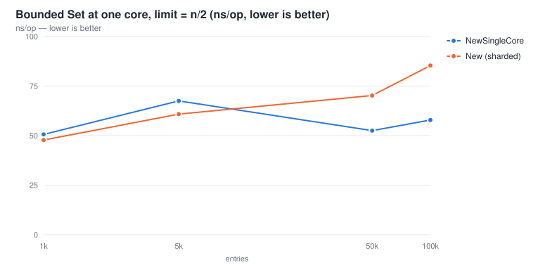
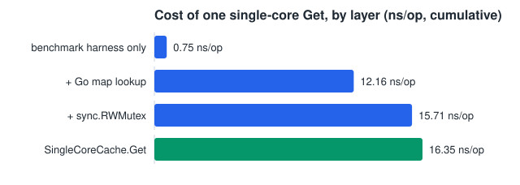

# goache benchmarks

The complete benchmark record. The [main README](../README.md) carries only the headline cross-library comparison; everything measured lives here.

> **`benchmarks/` (this directory) is documentation. `bench/` is code.** The cross-library benchmarks are a separate Go module in [`bench/`](../bench), kept apart so comparison-only dependencies never reach consumers of goache ([ADR 0008](../docs/adr/0008-separate-comparison-bench-module.md)). goache's own benchmarks are in `cache_bench_test.go` in the root module. This directory holds neither — it holds the numbers they produce and what they mean.

Machine for every number below: AMD Ryzen AI 9 HX 370 (24 threads), Go 1.26.2. All figures are ns/op unless stated otherwise, lower is better.

## Contents

- [How to run them](#how-to-run-them)
- [How these numbers are measured](#how-these-numbers-are-measured) — read this before comparing any two
- [goache on its own](#goache-on-its-own) — core operations, ingestion, TTL, deletion, eviction
- [Under a CPU limit](#under-a-cpu-limit) — across core counts, and against other libraries by core count
- [Single-core mode: `NewSingleCore`](#single-core-mode-newsinglecore) — the full field, the one exception, where a `Get` goes
- [Against other Go cache libraries](#against-other-go-cache-libraries) — all eight categories at five working-set sizes
- [Takeaways](#takeaways)

## How to run them

| Target | What it runs |
|---|---|
| `make bench` | goache's own benchmarks, 24 threads |
| `make bench-cpu` | goache's `Parallel*` swept across `-cpu=1,2,4,8,24` |
| `make bench-compare` | the full cross-library comparison |
| `make bench-compare-cpu` | concurrent `Get`, every library, swept across core counts |
| `make bench-compare-singlecore` | every library, every category, at `-cpu=1`, n=100k |
| `make bench-compare-singlecore-sizes` | the same field swept across every working-set size |
| `make bench-singlecore` | `SingleCoreCache` and `Cacher`, at one core |
| `make bench-singlecore-vs-sharded` | the two goache implementations head to head at one core |
| `make charts` | regenerates every SVG on this page from the numbers written here |

## How these numbers are measured

Two comparisons in this project's history came out backwards before being caught, which is why these rules exist ([ADR 0027](../docs/adr/0027-single-core-field-claim.md)):

- **`-count=10` and `benchstat` medians for any comparative claim.** At margins under ~15% a three-sample run picks the wrong winner. Install with `go install golang.org/x/perf/cmd/benchstat@latest`.
- **A comparison must come from a short run containing only the benchmarks being compared.** A 29-minute full-suite sweep reported `SingleCoreCache` losing `Set` by 18-48%; a focused ten-minute run of the same benchmarks showed it winning at every size. goache's benchmarks sit at the end of `bench/compare_test.go` and ran on a CPU that had been under load for twenty minutes. Ranking off a full sweep ranks file positions as much as implementations.
- **Tight variance proves nothing about cross-benchmark comparability.** Every sample of a late benchmark is taken under the same degraded conditions, so `± 1%` is entirely consistent with being 38% wrong.
- **Never run two measurements at once.** A probe run alongside a background benchmark produced values spanning 12.36-27.75 ns/op for the same operation.
- Opposite-direction movement between runs (A slower, B faster) means noise or ordering, not a real effect. Same-direction movement is drift and can be read through.

**Which goache is being measured.** `BenchmarkGoache_*` constructs with `NewSingleCore` at `GOMAXPROCS=1` and with `New` above it, because which implementation is correct is decided by the core count ([ADR 0029](../docs/adr/0029-benchmark-selects-implementation-by-core-count.md)). Either can be forced at any core count via `BenchmarkGoacheSharded_*` and `BenchmarkGoacheSingleCore_*`.

## goache on its own

`make bench`. Sharded `Cache`, 24 threads:

```
BenchmarkSet-24               39031269    30.84 ns/op     0 B/op   0 allocs/op
BenchmarkSetMany-24           11063608   103.4 ns/op    340 B/op   2 allocs/op
BenchmarkGet-24               51125614    22.94 ns/op     0 B/op   0 allocs/op
BenchmarkGetMiss-24           20432000    56.81 ns/op     7 B/op   0 allocs/op
BenchmarkParallelGetSet-24   189708112     6.236 ns/op    0 B/op   0 allocs/op
BenchmarkParallelGet-24     265806045     4.601 ns/op    0 B/op   0 allocs/op
```


`Set`/`Get` are zero-allocation on the hot path — both cycle over the same fixed 100k-key pool, so after the first pass every call overwrites an already-allocated entry rather than inserting a new one. `SetMany`'s benchmark never repeats a key, so it shows the real cost of a cold insert: 2 allocs/op (the per-call shard-bucket grouping, plus one now-unavoidable heap allocation per new entry — see [Automatic eviction](#automatic-eviction-withmaxsize) for why entries became individually heap-allocated). `GetMiss`'s alloc is the benchmark's own key-string construction, not the cache.

`ParallelGetSet`/`ParallelGet` dropped ~15-20% from pre-padding numbers (7.366 → 6.236, 5.474 → 4.601) after padding each shard to a full cache line in a contiguous `[]shard[K, V]` slice, removing false sharing between adjacent shards' mutexes — see [ADR 0018](../docs/adr/0018-gemini-analysis-experiments.md), which supersedes [ADR 0004](../docs/adr/0004-shard-storage-pointer-slice.md)'s earlier unpadded measurement. Single-threaded `Set`/`Get` are flat, as expected — false sharing is a multi-core effect.

### Ingestion: `WithCapacity` pre-sizing

Bulk-loading a fresh cache when the final size is roughly known upfront (`BenchmarkFreshLoad_*`, 10k entries via `SetMany` into a brand-new `Cache`):

```
BenchmarkFreshLoad_NoHint-24                1132   1047438 ns/op   2519739 B/op   14009 allocs/op
BenchmarkFreshLoad_WithCapacityHint-24      1274    816126 ns/op   2131853 B/op   12749 allocs/op
```


`WithCapacity` pre-sizes every shard's map so bulk inserts skip Go's incremental map growth and rehashing — but its relative payoff got noticeably noisier once `WithMaxSize` support made every new key's entry a separate heap allocation ([ADR 0016](../docs/adr/0016-clock-eviction.md)): pre-sizing the map no longer addresses the now-dominant allocation cost, and the speed improvement has ranged from ~6% to ~17% across repeated runs, down from a steady ~24% before that change. The allocation and memory savings stay consistent at ~9% and ~15%. Still worth using whenever the approximate final size is known upfront — just don't expect it to compensate for allocation-heavy cold-insert workloads the way it used to.

### Optional TTL

`SetWithTTL`/`Entry.TTL` let individual entries expire. The clock is only read when the *found* entry actually has a TTL, so looking up a plain `Set`/`SetMany` entry costs exactly what `Get` costs above. Below: `BenchmarkSetWithTTL`/`BenchmarkGetWithTTL` against entries that *do* have a TTL, plus `BenchmarkPurge` sweeping 100k already-expired entries across 256 shards.

```
BenchmarkSetWithTTL-24      28772359    41.96 ns/op     0 B/op   0 allocs/op
BenchmarkGetWithTTL-24      41216008    28.54 ns/op     0 B/op   0 allocs/op
BenchmarkPurge-24                210   5592490 ns/op     0 B/op   0 allocs/op
```


`entry` grew by 8 bytes (an `int64` deadline, 0 = never expires) to support this. Those 8 bytes show up as a real per-call cost on `SetWithTTL` itself (~19 ns — one `time.Now()` + `Add` + `UnixNano()`, unavoidable when actually setting a deadline) and on `GetWithTTL` (~8 ns — one clock read, only for entries that have a TTL). Steady-state `Get`/`Set` against non-TTL entries is unaffected, verified at `-cpu=1` to rule out scheduler noise ([ADR 0012](../docs/adr/0012-entry-ttl-field-size-cost.md)).

`Purge` is never called automatically — goache starts no background goroutine, timer or ticker ([ADR 0011](../docs/adr/0011-lazy-ttl-no-background-janitor.md)). Its own number moved substantially since TTL was added (2.56 ms baseline to 5.7-7.1 ms across repeated runs) for a reason unrelated to TTL: `WithMaxSize` support changed shard storage to individually heap-allocated entries, so a full-map sweep now chases one extra pointer per entry. This benchmark reports 0 allocs/op consistently — the slowdown is locality, not allocation, and it applies to any full-cache sweep.

### Deletion: `Delete` / `DeleteMany` / `Clear`

`Delete` and `DeleteMany` follow the same shape as `Set`/`SetMany` — `DeleteMany` groups keys by destination shard so each shard's lock is acquired once regardless of key count. `Clear` empties every shard with Go's builtin `clear()`, fast enough that isolating it from repopulation isn't meaningful; `BenchmarkClear` measures populate-then-`Clear` together.

```
BenchmarkDelete-24             30266572    39.73 ns/op      0 B/op   0 allocs/op
BenchmarkDeleteMany-24         17002633    70.53 ns/op     84 B/op   1 allocs/op
BenchmarkDeleteSetChurn-24     13441732    85.54 ns/op      0 B/op   0 allocs/op
BenchmarkSetManyRepeated-24      504318    2418 ns/op       0 B/op   0 allocs/op
BenchmarkDeleteManyRepeated-24   598339    2014 ns/op       0 B/op   0 allocs/op
BenchmarkClear-24                100  10891976 ns/op   22986902 B/op   106407 allocs/op
```


`Delete` is zero-allocation, same cost class as `Set`. `DeleteMany`'s single alloc/op is the same per-call shard-bucket grouping `SetMany` pays. `Clear`'s number includes populating a fresh 100k-entry cache first (~1.0 ms); the `Clear()` call itself is a fraction of the ~11.0 ms total, and essentially all 106,407 allocs/op belong to the `SetMany` population preceding it.

`BenchmarkDeleteSetChurn` — delete a key, immediately re-insert it, the workload the cross-library `Delete` comparison measures — is fully allocation-free. On unbounded caches `Delete` parks the removed entry in a one-slot per-shard freelist and the next brand-new-key `Set` on that shard reuses it, instead of paying one heap allocation per new key. That is ~31% faster churn (124.8 → 85.5 ns/op) for ~1-2 ns added to `Delete` itself, a single pointer store ([ADR 0019](../docs/adr/0019-single-slot-freelist.md)). Bounded caches don't use the freelist — their delete/evict path already recycles through a `sync.Pool` ([ADR 0018](../docs/adr/0018-gemini-analysis-experiments.md)).

`BenchmarkSetManyRepeated`/`BenchmarkDeleteManyRepeated` measure repeated bulk calls against one long-lived cache — the shape a running service produces, as opposed to the throwaway-cache-per-call benchmarks above which measure cold cost only. Both are **completely allocation-free** now: the shard-grouping scratch space (one outer slice plus one per non-empty bucket — **101 allocations per call** before this, hidden behind a benchmark reporting "2 allocs/op") is kept on the cache and reused via a single atomic swap, making repeated bulk calls 54-60% faster. One-shot bulk calls on a fresh cache pay a small fixed reset cost instead (3-6%), and 10k-entry bulk ingestion is unaffected ([ADR 0022](../docs/adr/0022-bulk-bucket-scratch-reuse.md), which also records why a `sync.Pool` was tried first and abandoned).


### Automatic eviction: `WithMaxSize`

`WithMaxSize(n)` bounds the cache to **at most** n entries and turns on per-shard CLOCK (second-chance) eviction once a shard is full. The budget is split so per-shard limits sum to exactly n, so `Len()` can never exceed it; if n is below the shard count, the shard count drops to the largest power of two ≤ n so every shard still gets a slot ([ADR 0020](../docs/adr/0020-shard-count-does-not-scale-eviction.md) — this used to be a soft "roughly n" that could overshoot badly: `WithMaxSize(100)` on 256 shards held 256 entries). Because keys land by hash rather than perfectly evenly, a cache under churn typically settles somewhat *below* n — n bounds memory, it doesn't reserve it.

CLOCK was chosen over two alternatives ([ADR 0016](../docs/adr/0016-clock-eviction.md)):

- True LRU (move-to-front on every `Get`) would need `Get` to take a write lock on every hit, undoing the entire point of sharding.
- W-TinyLFU-style admission (what theine and otter use) gives a better hit ratio under skewed workloads, but costs real CPU on every `Set` — exactly the cost goache beats those libraries on.

CLOCK keeps `Get` at effectively its current cost: each entry carries one atomic "referenced" bit, flipped by `Get` with a plain atomic store — no write lock, no ring mutation. Eviction, which does need the write lock, walks a per-shard circular ring from a hand pointer, clearing the bit on anything set and evicting the first entry already clear.

```
BenchmarkSetWithMaxSize-24   14540342    72.63 ns/op     0 B/op   0 allocs/op
BenchmarkGetWithMaxSize-24   41349081    26.19 ns/op     0 B/op   0 allocs/op
BenchmarkEvictionChurn-24    10518242   115.0 ns/op      8 B/op   1 allocs/op
BenchmarkEvictionChurnLarge-24 10158661  125.5 ns/op      8 B/op   1 allocs/op
BenchmarkEvictionChurnHot-24  10780498   125.3 ns/op      8 B/op   1 allocs/op
BenchmarkParallelGetWithMaxSize-24 248959453   4.853 ns/op   0 B/op   0 allocs/op
```


`GetWithMaxSize` is barely different from plain `Get` (26.19 vs 22.94) — the only added cost is one atomic bit store, and `ParallelGetWithMaxSize` confirms it holds under concurrency (4.853 against plain `ParallelGet`'s 4.601). `SetWithMaxSize` (capped at half the key pool, so roughly every other `Set` evicts) and `EvictionChurn` (always full, *every* `Set` evicts) show the cost of enabling eviction: 72.63 and 115.0, both down substantially (~44% and ~34%) from pre-pooling numbers of 130.8 and 174.9 after bounded shards started recycling entries through a `sync.Pool`. Allocs/op dropped 1→0 and 2→1 accordingly. That pooling is deliberately *not* applied to unbounded caches — an earlier cache-wide attempt regressed `Delete`/`Clear`/`SetMany`/`FreshLoad_*` by 61-78%, since nothing ever draws entries back out of a pool that eviction never drains ([ADR 0018](../docs/adr/0018-gemini-analysis-experiments.md)).

**Supporting eviction at all requires a real, unconditional cost, not just an opt-in one.** To let `Get` flip the CLOCK bit without a write lock, shard storage changed from `map[K]entry[V]` to `map[K]*entry[K, V]` — individually heap-allocated entries, for *every* `Cache`, whether or not `WithMaxSize` is ever called. Ring maintenance, the eviction sweep and pool interaction are all skipped when no limit is configured; the pointer-per-entry storage is not. In practice the cost is small for steady-state workloads and real for cold-insert-heavy and full-sweep ones ([ADR 0016](../docs/adr/0016-clock-eviction.md)).

**The CLOCK sweep itself is not where bounded caches spend their time.** `EvictionChurnLarge` — a single shard holding 100,000 entries, so the hand *could* walk 100,000 slots — costs 125.5 ns/op, barely more than the 10,000-entry `EvictionChurn` at 115.0, and *less* than the 269.8 the cross-library comparison shows at n=1,000,000 spread over 256 shards of ~1,950 slots each. Instrumenting the hand confirms why: it walks **0.00-2.54 slots per eviction** across every workload measured, and 1.00 even under a continuous nine-reads-per-write mix. Entries near the hand are the oldest, their reference bits cleared on an earlier pass, while reads land on recently-inserted keys far from it. A contiguous bit-map rewrite of the sweep was designed and then rejected on that evidence without being implemented ([ADR 0023](../docs/adr/0023-reject-clock-bitmap.md)). What the `Bounded` numbers track is working set versus CPU cache: goache's *unbounded* `Set` already scales 4.56x from n=1,000 to n=1,000,000 with no eviction at all, against 5.68x for `Bounded` — eviction contributes roughly 1.25x and the memory hierarchy the rest.

## Under a CPU limit

Go services frequently run in containers that get a fraction of a core. A Kubernetes pod with `limits.cpu: 100m` is entitled to a tenth of one CPU, and since Go 1.25 the runtime derives `GOMAXPROCS` from the cgroup quota — so such a pod runs at **`GOMAXPROCS=1`**, not at the host's core count. Every other number on this page was measured on 24 cores, the opposite end of that range. See [ADR 0025](../docs/adr/0025-cpu-constrained-benchmarks.md).

### goache across core counts

ns/op, 100,000-entry working set. `Get`/`Set` are single-goroutine and shown for reference; the `Parallel*` rows are the ones `GOMAXPROCS` actually affects.

| Benchmark | 1 core | 2 | 4 | 8 | 24 |
|---|---|---|---|---|---|
| `Get` (single-goroutine) | 25.02 | 24.93 | 25.27 | 24.16 | 24.24 |
| `Set` (single-goroutine) | 33.72 | 32.40 | 32.27 | 32.71 | 31.61 |
| `ParallelGet` | 23.36 | 14.02 | 7.506 | 7.758 | 4.614 |
| `ParallelGetSet` | 27.47 | 17.32 | 11.58 | 9.312 | 6.044 |
| `ParallelGetWithMaxSize` | 26.74 | 16.56 | 8.687 | 9.067 | 4.794 |
| `ParallelGetConstrained` (32 goroutines per core) | 23.29 | 14.58 | 7.609 | 7.762 | 4.638 |
| `ParallelGetSetConstrained` (32 goroutines per core) | 25.98 | 15.35 | 9.609 | 10.42 | 6.639 |


**At one core, concurrent `Get` costs the same as a plain single-goroutine `Get`** (23.36 vs 25.02). That is the honest shape of it: with a single `P` only one goroutine runs at a time, so there is no lock contention for sharding to relieve — the sharded `Cache` pays the shard hash and gets nothing back. Each added core roughly halves the cost up to about four, and 24 cores land at 4.6 ns/op, 5x the one-core figure.

**Oversubscription is not a separate problem.** The `*Constrained` rows put 32 goroutines in flight per core — a request handler serving many connections on little CPU — and read performance is unchanged from the default (23.29 vs 23.36 at one core). Only mixed read/write at high core counts pays for it (6.639 vs 6.044 at 24 cores, about 10%).

### Against other libraries, by core count

Concurrent `Get`, 100,000 entries, ns/op. The `goache` row here is the sharded `Cache` at every column, to isolate the core-count effect on one implementation; `NewSingleCore` is the [next section](#single-core-mode-newsinglecore). Rows ordered by one-core cost:

| Library | 1 core | 2 | 4 | 8 | 24 |
|---|---|---|---|---|---|
| go-cache | **16.88** | 25.50 | 17.56 | 27.29 | 37.41 |
| goache (`New`) | 24.51 | **14.08** | **7.399** | 7.587 | 4.687 |
| otter | 34.38 | 24.86 | 9.695 | **5.899** | **3.924** |
| ristretto | 37.31 | 32.37 | 16.10 | 15.99 | 8.211 |
| freecache | 103.7 | 52.92 | 27.16 | 26.02 | 16.18 |
| theine | 133.5 | 81.79 | 75.17 | 12.57 | 6.443 |


**`New`'s sharded cache is not the fastest choice on a single core — go-cache is: 16.88 vs 24.51, so `New` costs 45% more there.** go-cache's one global mutex is uncontended when only one goroutine can run, so it pays nothing for locking and nothing for a shard hash. That advantage inverts immediately: at two cores `New` costs 45% *less* (14.08 vs 25.50), and by 24 cores it is 8x cheaper (4.687 vs 37.41), because go-cache's single lock gets *worse* with every core added while goache's cost keeps falling.

The crossover sits between one and two cores. In Kubernetes terms: a pod at `limits.cpu: 100m` or `500m` runs the leftmost column; from roughly `2000m` upward `New` is the fastest option in this table until otter overtakes it at eight cores. **For the leftmost column, use `NewSingleCore`.**

These numbers use `GOMAXPROCS` as the stand-in for a CPU limit, which models how many threads run in parallel — the thing the sharding argument turns on. It does **not** model CFS throttling, where a pod that exhausts its quota is frozen entirely until the next period. A probe running single-goroutine `BenchmarkGet` inside `docker run --cpus=0.1` measured 485.3 ns/op against 25.02 at `GOMAXPROCS=1`: 19x slower with no concurrency involved, about 1.9x worse than the 10% quota alone explains. Read the one-core column as the optimistic end of sub-core behaviour; [docs/sub-core-benchmark-plan.md](../docs/sub-core-benchmark-plan.md) scopes measuring it properly.

Also visible: **freecache and theine are the wrong choice on constrained CPU specifically** — at one core they cost 103.7 and 133.5, four to six times goache, and theine only becomes competitive at eight cores. Their designs assume parallelism a throttled container does not have.

## Single-core mode: `NewSingleCore`

`NewSingleCore` returns a second, unsharded implementation for exactly that regime: one map behind one `sync.RWMutex`, no shard hash, no shard-slice indirection, and — unless `WithMaxSize` is set — entries carrying only a value and a deadline instead of the CLOCK bookkeeping `Cache` needs. Same methods, same options; `WithShardCount` is ignored. Why it exists: [ADR 0026](../docs/adr/0026-single-core-cache.md).

All numbers in this section are at **`-cpu=1`**, 100,000-entry working set, `-count=10`, benchstat medians.

### Against the whole field

Every category `NewSingleCore` has an equivalent for, against every library that has one. Median ± range.

| Benchmark | `NewSingleCore` | Best competitor | Lead |
|---|---|---|---|
| `Bounded` (limit = n/2) | **54.84** ± 0% | ristretto 105.6 ± 6% | **-48%** |
| `Set` | **23.90** ± 1% | go-cache 38.20 ± 3% | **-37%** |
| `SetWithTTL` | **33.27** ± 1% | go-cache 52.56 ± 2% | **-37%** |
| `ParallelGetSet` (90/10) | **17.14** ± 0% | go-cache 19.37 ± 1% | -11.5% |
| `Get` | **16.17** ± 0% | go-cache 17.29 ± 2% | -6.5% |
| `GetWithTTL` | **21.03** ± 0% | go-cache 22.41 ± 1% | -6.2% |
| `ParallelGet` | **16.11** ± 1% | go-cache 16.94 ± 1% | -4.9% |
| `Delete` (churn) | **75.11** ± 0% | go-cache 75.39 ± 1% | -0.4% (tie) |


**Fastest in all eight.** Two caveats stated up front, because both go against goache:

- **The read leads are thin.** 4.9-6.5% over go-cache on `Get`/`ParallelGet`/`GetWithTTL`. An earlier version of this claimed 20-25%; that came from a `-count=3` run in which go-cache's numbers were noise-inflated, and it was wrong. The large leads are on writes, where go-cache boxes every value as `interface{}` and allocates — a structural difference no measurement noise creates.
- **`Delete` is a tie, not a win.** 75.11 against 75.39 at ±0-1%. Delete-then-reinsert churn costs goache one extra map lookup go-cache does not pay: pointer storage has to find the existing entry to recycle it, while go-cache stores its value inline and blindly overwrites. That lookup is worth about 9.6 ns here and about -2.9 ns on every single `Get`, the far more frequent operation. A deliberate trade, decomposed in [ADR 0027](../docs/adr/0027-single-core-field-claim.md).

### Every library, every category, at one core

Lower is better; bold is the winner of each row.

| Benchmark | `NewSingleCore` | `New` (sharded) | go-cache | freecache | ristretto | theine | otter |
|---|---|---|---|---|---|---|---|
| `Get` | **16.17** | 27.04 | 17.29 | 101.0 | 37.11 | 122.6 | 33.98 |
| `ParallelGet` | **16.11** | 28.03 | 16.94 | 99.81 | 37.20 | 122.8 | 33.97 |
| `ParallelGetSet` | **17.14** | 24.66 | 19.37 | 98.83 | 54.76 | 119.5 | 58.59 |
| `GetWithTTL` | **21.03** | 29.80 | 22.41 | 101.0 | 38.38 | 118.3 | 51.79 |
| `Set` | **23.90** | 36.63 | 38.20 | 82.98 | 148.8 | 98.56 | 183.3 |
| `SetWithTTL` | **33.27** | 43.99 | 52.56 | 80.53 | 214.5 | 115.0 | 255.6 |
| `Bounded` | **54.84** | 80.88 | — | — | 105.6 | 183.9 | 217.4 |
| `Delete` | **75.11** | 110.6 | 75.39 | 188.3 | 498.5 | 282.9 | 241.3 |



go-cache and freecache have no `Bounded` row: go-cache has no eviction at all, and freecache bounds by byte-buffer size rather than entry count, so neither has a comparable "limit = n/2" mode.

The two libraries whose authors document them as throughput leaders — theine and otter — are the slowest and third-slowest on reads here. That does not contradict their claims: both are built for many-core parallel throughput, and their W-TinyLFU admission bookkeeping plus (for theine) a hierarchical timer wheel is per-operation cost a single core pays in full and gets nothing back for. freecache pays the same way for keeping entries off the Go heap: every `Get` copies bytes out of a ring buffer and allocates (8 B/op, 1 alloc/op) where goache returns a value.

### One exception, and it is against `New`, not a competitor

The table above is at 100,000 entries. Swept across sizes, seven of eight categories keep their ranking. **`Bounded` does not**: below roughly 10,000 entries the sharded `Cache` evicts faster than `NewSingleCore`, even on one core.

| n (limit = n/2) | `NewSingleCore` | `New` (sharded) | |
|---|---|---|---|
| 1,000 | 50.60 ± 3% | **47.77** ± 1% | sharded -5.6% |
| 5,000 | 67.50 ± 2% | **60.85** ± 2% | sharded -9.9% |
| 50,000 | **52.53** ± 1% | 70.24 ± 1% | -25% |
| 100,000 | **57.87** ± 2% | 85.36 ± 3% | -32% |



Sharding is useless for locking at one core, but it still *partitions*: at `WithMaxSize(500)` the sharded cache splits that budget across 256 shards, so each keeps a CLOCK ring of one or two nodes, while `NewSingleCore` keeps a single ring of 500. Reproduced across four independent runs.

**So: on one core, use `NewSingleCore` — unless you need `WithMaxSize` with a bound under ~10,000 entries, where `New` is faster.** Everything else here still points at `NewSingleCore`, including unbounded writes at every size measured.

One oddity is left unexplained on purpose: `NewSingleCore`'s bounded cost is not monotonic in size — 5,000 entries costs more per operation than 50,000. It reproduces, so it is not noise, and pre-sizing the map does not remove it ([ADR 0027](../docs/adr/0027-single-core-field-claim.md) records the refuted hypothesis).

### Where a `Get` actually goes, and why there is little left

Decomposed against a 100,000-entry map at `-cpu=1`, `-count=10`:

```
key indexing + modulo (benchmark harness only)  0.7508 ns ± 1%
bare map lookup, no synchronization              12.16 ns ± 1%
  + sync.RWMutex RLock/RUnlock                   15.71 ns ± 1%   +3.55
SingleCoreCache.Get                              16.35 ns ± 2%   +0.64
```



About 70% of a `Get` is Go's map lookup — a cost shared with every competitor using Go's map — 22% is the lock, and 4% is goache's own code. Two promising-looking routes are measured shut:

- **`sync.Mutex` is not cheaper than `sync.RWMutex`** at one core: 15.74 vs 15.71, indistinguishable.
- **A hand-rolled reader scheme buys 0.35 ns.** A bare `atomic.Int32` reader counter with no writer-starvation handling — not a shippable design — lands at 15.36. `sync.RWMutex` is already within 2% of the floor any such scheme must pay in atomic read-modify-writes.

### Against `New`, benchmark by benchmark

| Benchmark | `New` | `NewSingleCore` | |
|---|---|---|---|
| `DeleteManyRepeated` | 1.975 µs | 205.2 ns | **-90%** |
| `SetManyRepeated` | 2.404 µs | 907.6 ns | **-62%** |
| `SetMany` | 98.11 (340 B, 2 allocs) | 57.91 (85 B, 1 alloc) | **-41%** |
| `Purge` | 5.680 ms | 3.547 ms | **-38%** |
| `ParallelGetSet` | 25.43 | 17.32 | **-32%** |
| `Get` | 23.27 | 16.01 | **-31%** |
| `ParallelGetConstrained` | 23.29 | 16.05 | -31% |
| `ParallelGet` | 23.23 | 16.12 | -31% |
| `Clear` | 12.41 ms / 21.9 MiB | 8.605 ms / 8.2 MiB | -31% / -63% |
| `ParallelGetSetConstrained` | 25.43 | 17.93 | -30% |
| `SetWithMaxSize` | 77.13 | 55.96 | -27% |
| `GetWithMaxSize` | 26.52 | 19.27 | -27% |
| `Set` | 31.59 | 23.71 | -25% |
| `GetWithTTL` | 27.96 | 21.00 | -25% |
| `EvictionChurn` | 133.7 | 103.3 | -23% |
| `SetWithTTL` | 41.67 | 33.88 | -19% |
| `GetMiss` | 59.54 | 50.65 | -15% |
| `DeleteSetChurn` | 88.70 | 75.56 | -15% |
| `EvictionChurnLarge` | 135.5 | 117.2 | -14% |
| `EvictionChurnHot` | 135.0 | 116.8 | -14% |


The two largest wins were not the predicted ones. `DeleteManyRepeated` (-90%) and `SetManyRepeated` (-62%) come from there being nothing to group: with one shard the entire bulk-grouping machinery [ADR 0022](../docs/adr/0022-bulk-bucket-scratch-reuse.md) exists to amortize disappears rather than being amortized.

The `EvictionChurn*` rows answer the open question about putting the whole eviction budget in one CLOCK ring instead of 256. Even `EvictionChurnHot` — every reference bit pre-set, CLOCK's worst case — is *cheaper* here (116.8 vs 135.0), confirming [ADR 0023](../docs/adr/0023-reject-clock-bitmap.md)'s finding that the sweep is not where bounded-cache cost lives. These two rows previously read -8% and -4%, both from a `-count=3` run; re-measured at `-count=10` they are -14%. That correction happens to go in goache's favor, which is exactly why it was worth making ([ADR 0027](../docs/adr/0027-single-core-field-claim.md)).

### The trade, stated plainly

With two or more cores, `New` pulls ahead immediately and keeps improving as cores are added, while `NewSingleCore`'s one lock becomes the bottleneck — the same shape go-cache has above. **If you declare single-core and then run on many cores, you get one global lock and you will feel it.** When in doubt, use `New`.

Choosing at run time requires the `Cacher[K, V]` interface, whose dynamic dispatch is not free: 23.40 → 25.46 ns/op (+8.8%) on `Get` through the interface versus the concrete type. That is why `New` and `NewSingleCore` return concrete types — nobody pays it unless they ask. Full reasoning and the rejected alternatives in [ADR 0026](../docs/adr/0026-single-core-cache.md).

## Against other Go cache libraries

Benchmarked head-to-head in [`bench/`](../bench), a separate module so comparison-only dependencies never reach consumers of goache. Compared against:

- **[patrickmn/go-cache](https://github.com/patrickmn/go-cache)** — the naive baseline: single global `RWMutex`, values boxed as `interface{}`.
- **[coocood/freecache](https://github.com/coocood/freecache)** — sharded, GC-avoiding (`[]byte`-only keys/values, no generics), entries kept off the Go heap in ring buffers.
- **[dgraph-io/ristretto/v2](https://github.com/dgraph-io/ristretto)** — TinyLFU admission control and async, best-effort `Set`.
- **[Yiling-J/theine-go](https://github.com/Yiling-J/theine-go)** — Caffeine-inspired, adaptive W-TinyLFU plus a hierarchical timer wheel for TTL. Requires a bounded `MaximumSize` (no unbounded mode) and an explicit per-entry cost on `Set`.
- **[maypok86/otter/v2](https://github.com/maypok86/otter)** — also Caffeine-inspired; its author documents it as having had "long-standing unbeatable throughput" among Go caches.

See [docs/competitor-analysis.md](../docs/competitor-analysis.md) for what each trades off qualitatively, and [ADR 0017](../docs/adr/0017-size-parametrized-benchmarks.md) for the methodology: every category runs at five working-set sizes, and covers every feature goache has an equivalent for.

Every table below ran at 24 threads, so every `goache` cell is the sharded `Cache`. **Mixed provenance, noted for transparency**: the five competitors' numbers come from a single clean run with no other work in parallel; goache's own rows were re-measured afterward, alone, after [ADR 0018](../docs/adr/0018-gemini-analysis-experiments.md)'s changes to `cache.go`. Only goache's implementation changed, so refreshing just its rows is valid — but goache's cells and the competitors' cells were measured in separate runs, not the same one.

### Set

| Library | 1,000 | 5,000 | 50,000 | 100,000 | 1,000,000 |
|---|---|---|---|---|---|
| goache | 27.91 | 23.78 | 28.72 | 32.63 | 127.2 |
| go-cache | 28.27 | 30.07 | 35.28 | 39.11 | 130.6 |
| freecache | 35.83 | 36.63 | 59.13 | 86.50 | 187.0 |
| otter | 139.7 | 130.7 | 133.2 | 137.6 | 225.8 |
| theine | 157.1 | 158.0 | 176.2 | 200.4 | 413.0 |
| ristretto | 223.7 | 236.4 | 240.5 | 287.4 | 362.3 |


### Get

| Library | 1,000 | 5,000 | 50,000 | 100,000 | 1,000,000 |
|---|---|---|---|---|---|
| go-cache | 12.94 | 12.56 | 15.79 | 17.40 | 70.39 |
| goache | 22.77 | 16.67 | 21.01 | 23.84 | 87.98 |
| otter | 34.71 | 35.01 | 37.89 | 40.79 | 149.2 |
| ristretto | 42.59 | 41.93 | 61.51 | 79.35 | 178.5 |
| freecache | 47.67 | 48.57 | 72.66 | 108.4 | 208.3 |
| theine | 87.17 | 86.33 | 111.6 | 132.1 | 286.4 |


### ParallelGet

| Library | 1,000 | 5,000 | 50,000 | 100,000 | 1,000,000 |
|---|---|---|---|---|---|
| goache | 5.673 | 4.573 | 4.235 | 4.578 | 9.250 |
| otter | 3.262 | 6.722 | 7.479 | 5.980 | 9.934 |
| theine | 5.258 | 5.220 | 5.978 | 6.324 | 10.52 |
| ristretto | 9.079 | 8.217 | 7.534 | 8.674 | 10.88 |
| freecache | 14.59 | 14.95 | 15.39 | 15.66 | 17.59 |
| go-cache | 36.74 | 37.01 | 37.05 | 36.61 | 38.42 |


### SetWithTTL

otter has no per-`Set` TTL argument — it configures a fixed write-based expiry policy at construction (`ExpiryWriting`) instead; its numbers here use that, documented in `bench/compare_test.go`'s `newOtterTTL`.

| Library | 1,000 | 5,000 | 50,000 | 100,000 | 1,000,000 |
|---|---|---|---|---|---|
| goache | 35.33 | 30.91 | 37.67 | 42.10 | 171.7 |
| go-cache | 34.41 | 36.26 | 46.66 | 51.80 | 201.2 |
| freecache | 36.32 | 38.01 | 63.18 | 88.99 | 194.8 |
| otter | 159.2 | 159.2 | 168.8 | 174.2 | 260.6 |
| theine | 181.6 | 176.5 | 207.0 | 261.3 | 420.2 |
| ristretto | 248.2 | 253.1 | 299.5 | 372.8 | 441.2 |


### GetWithTTL

| Library | 1,000 | 5,000 | 50,000 | 100,000 | 1,000,000 |
|---|---|---|---|---|---|
| go-cache | 14.10 | 14.98 | 20.59 | 22.70 | 94.21 |
| goache | 28.26 | 21.08 | 26.07 | 28.35 | 93.24 |
| otter | 47.96 | 50.17 | 54.57 | 59.86 | 163.2 |
| ristretto | 47.16 | 46.00 | 58.42 | 94.23 | 187.8 |
| freecache | 47.64 | 48.50 | 74.35 | 106.1 | 211.9 |
| theine | 86.90 | 83.13 | 103.1 | 136.0 | 287.9 |


### Delete

Measured as delete-then-reinsert churn, not isolated deletion — see [ADR 0015](../docs/adr/0015-delete-clear-api.md) for why an isolated-`Delete` benchmark hung for minutes.

| Library | 1,000 | 5,000 | 50,000 | 100,000 | 1,000,000 |
|---|---|---|---|---|---|
| go-cache | 53.64 | 58.12 | 68.42 | 72.00 | 191.4 |
| goache | 65.60 | 64.54 | 82.52 | 87.69 | 198.0 |
| freecache | 83.20 | 102.9 | 159.0 | 200.4 | 274.5 |
| otter | 225.0 | 226.0 | 243.7 | 257.1 | 361.5 |
| theine | 408.9 | 418.1 | 431.3 | 492.9 | 583.1 |
| ristretto | 485.0 | 471.8 | 514.6 | 537.1 | 649.0 |


### Bounded

`Set` against a cache actively evicting, limit = n/2. go-cache and freecache have no comparable mode.

| Library | 1,000 | 5,000 | 50,000 | 100,000 | 1,000,000 |
|---|---|---|---|---|---|
| goache | 47.52 | 61.31 | 69.12 | 110.4 | 269.8 |
| otter | 140.9 | 131.3 | 156.1 | 159.9 | 237.3 |
| ristretto | 125.5 | 108.6 | 104.0 | 89.94 | 76.34 |
| theine | 199.4 | 190.3 | 184.8 | 233.1 | 347.5 |


## Takeaways

- **Every library's single-threaded `Get` degrades noticeably from 1,000 to 1,000,000 entries** (go-cache 12.94 → 70.39, goache 22.77 → 87.98, otter 34.71 → 149.2, ristretto 42.59 → 178.5, theine 87.17 → 286.4) — a universal effect of the working set outgrowing CPU cache, not specific to any one design. goache's *relative* degradation is in line with everyone else's and its *absolute* numbers stay competitive throughout.
- **Under real concurrency, sharded/striped designs hold their ground at every size.** goache, otter and theine all stay roughly in the 4-11 ns/op range even at 1,000,000 entries, while go-cache's single global lock is essentially flat regardless of size (36.7 → 38.4) — it was never bottlenecked by cache size, only by lock contention, and that bottleneck does not change however big the map gets. The sharding argument playing out as designed, at 1,000x the original single-size comparison's scale.
- **goache leads `ParallelGet` at every size except n=1,000**, after padding each shard to a cache line to remove false sharing between adjacent shards ([ADR 0018](../docs/adr/0018-gemini-analysis-experiments.md)) — previously it trailed both otter and theine at most sizes.
- **Delete churn is allocation-free and second only to go-cache.** The per-shard freelist ([ADR 0019](../docs/adr/0019-single-slot-freelist.md)) dropped goache's row from 93.27-220.5 to 65.60-198.0, overtaking freecache at every size. The remaining gap to go-cache is structural — the churn cycle pays goache's shard-routing hash twice per iteration, the price of the sharding that wins `ParallelGet`.
- **ristretto and theine show real, substantial run-to-run variance — enough to flip a conclusion.** Re-running this exact suite (same machine, same code, clean wait, no parallel work) moved theine's `Set` at n=1,000 from 271.7 to 157.1 (a ~42% swing) and **flipped ristretto's `Bounded` scaling trend**: the first run showed it essentially flat (111.6 → 117.8 across 1,000 → 1,000,000), this run shows it clearly *decreasing* (125.5 → 76.34). goache, go-cache, freecache and otter stayed consistent across both. The most plausible explanation is that ristretto's buffered-write goroutines and theine's timer wheel plus background maintenance make them more sensitive to scheduler noise than the synchronous libraries — so single-run comparisons involving those two should be read as directional, and any conclusion from one run of their numbers deserves a second run before being trusted.
- **goache's `WithMaxSize` eviction cost still grows with cache size**: 47.52 at 1,000 entries to 269.8 at 1,000,000, roughly 5.7x — matching [ADR 0016](../docs/adr/0016-clock-eviction.md)'s locality finding, since the CLOCK ring is an intrusive per-shard linked list of individually heap-allocated entries. Absolute numbers at small and mid sizes dropped 35-40% after gating `sync.Pool` recycling to bounded shards, though that win shrinks at n=1,000,000 and converges back to roughly the old number. Given the variance above, whether competitors' bounded cost scales better is genuinely unclear from this data — ristretto's own numbers moved in opposite directions between two clean runs — but goache's upward trend is the one solid, reproduced finding. **Raising the shard count does not fix it**: measured across 256/512/1024/2048/4096 shards, bounded eviction got *worse* with more shards at the sizes that matter (+25% at n=100,000, +19% at n=1,000,000), so `WithShardCount` is not the knob ([ADR 0020](../docs/adr/0020-shard-count-does-not-scale-eviction.md)).
- **`Set`**: goache is fastest at every size up to 100,000, and the only zero-allocation `Set` for repeated keys. Every admission-policy cache (theine, otter, ristretto) pays eviction-policy bookkeeping on every `Set` — the trade goache's default opts out of.
- **ristretto's `Set` is asynchronous and best-effort** — values can be dropped by its admission policy, a materially different contract than goache's synchronous, always-succeeds `Set`. Not a drop-in semantic replacement, but included since it is the most commonly reached-for high-performance Go cache today.
- **theine and otter are not drop-in semantic replacements either**: both implement W-TinyLFU admission, meaning `Set` can be a no-op if the entry loses the admission race. goache's `Set` always lands, whether or not `WithMaxSize` is configured — a full shard evicts something else rather than rejecting the incoming write. Pick goache for guaranteed writes with a size bound whose cost is at least predictable; pick theine/otter/ristretto when you need a hit-ratio-optimizing admission policy and can accept probabilistic admission.

## Every decision behind these numbers

Each optimization here — shipped or reverted — has a record in [docs/adr/](../docs/adr/README.md), including the failed experiments, which are there specifically so the same dead end is not re-explored. The ones this page leans on most: [0016](../docs/adr/0016-clock-eviction.md) (CLOCK eviction), [0018](../docs/adr/0018-gemini-analysis-experiments.md) (shard padding, gated pooling, three rejections), [0023](../docs/adr/0023-reject-clock-bitmap.md) (why the sweep was left alone), [0025](../docs/adr/0025-cpu-constrained-benchmarks.md) (the CPU-limit sweep), [0026](../docs/adr/0026-single-core-cache.md) and [0027](../docs/adr/0027-single-core-field-claim.md) (single-core mode and its claim), [0029](../docs/adr/0029-benchmark-selects-implementation-by-core-count.md) (which implementation the benchmarks construct).
